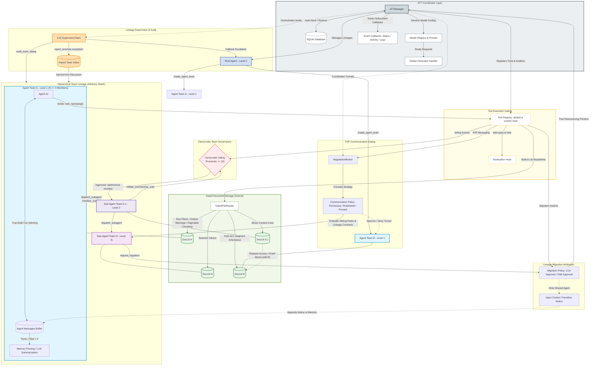

# AI-Team-Team (ATT)

A lightweight, generic, hierarchical dynamic multi-agent collaboration framework in Python.

Instead of treating AI as isolated chatbots, ATT treats them as members of a living organization.

AI can freely form teams, define how they discuss things with each other, how AI teams discuss things, and create all sorts of incredibly complex hierarchical (or dynamic) relationships.

Hundreds, thousands, even tens of thousands of AIs work together in an orderly manner.

<details>
<summary>More</summary>
ATT empowers AI agents to transition from passive context consumers to active, self-governing groups. It organizes agents into dynamic, tree-like recursive lineages with built-in consensus debates, ReAct reasoning loops, communication permission gating, size-aware file context protection, and supervisory health auditing.
</details>

Many thanks to Gemini and GPT for their help!

> [!NOTE]
> The project already features a lot of really fun and innovative designs, with an even more groundbreaking architecture in the works. \
> (It’s still a little rough around the edges though 👀)

> [!TIP]
> If you notice any issues or have any suggestions and have the time, \
> please leave them in the Issues section. Thank you.

[](#)
[](LICENSE.txt)
[](docs/README.md)
[](#)

The ATT framework organizes dynamic multi-agent topologies into clean, recursive lineages with robust governance, safety gates, and state persistence:

### 🧬 Topology & Lineage Control

* **[Tree-like Lineage Spawning](docs/Dynamic_Delegation.md)**: Spawns recursive child agent teams (`AgentTeam`) at runtime to arbitrary depths, strictly bounded by depth limits to prevent stack overflow.
* **[Autonomous Member Configs](docs/Dynamic_Delegation.md#1-dynamic-spawning-&-lineage-hierarchy)**: Defines dynamic child memberships mapping role presets, custom system instructions, and LLM aliases to shape custom agent personalities.
* **[Dynamic Lineage Migration](docs/Dynamic_Delegation.md)**: Permits active teams to request parent-hierarchy migrations, arbitrated by modular strategies with loop/cycle detection and parent notification logs.
* **[Hierarchical Topology Map](docs/Dynamic_Delegation.md)**: Injects an ASCII-drawn indented tree map of active teams (displaying purposes, status, and progress metrics in real-time) directly into the agent prompt context.
* **[Global Expert Discovery](docs/State_Persistence.md)**: Automatically appends a directory of all active system experts (names, roles, and profiles) into the agent's identity context to facilitate peer discovery.

### 🧠 ReAct Loops & Execution Engine

* **Bounded ReAct Loops**: Executes standard Thought/Action/Observation reasoning cycles, capped by max steps to prevent runaway API tokens.
* **Robust Argument Parser**: A safe literal lexical parser (`ast.literal_eval`) with multiline XML support, code block stripping, and a comma-merging heuristic to handle unquoted complex strings (like SQL queries).
* **[Dialogue Memory Compression](docs/State_Persistence.md)**: Automates memory pruning by summarizing early conversation turns using the agent's LLM while preserving the latest high-fidelity messages.
* **[Model Registry & Callbacks](docs/user/Quickstart.md#7-model-registry-and-global-generator-callback)**: Delegates all LLM generation logic to a single global callback handler (`generator_handler`), keeping the framework lightweight and vendor-independent.

### 🗳️ Governance & Inter-Team Communication

* **[Democratic Voting System](docs/Dynamic_Delegation.md#5-team-governance-&-democratic-voting-system)**: Features an asynchronous voting pipeline to add or remove members, requiring unanimous participation and a $\ge 2/3$ agreement majority.
* **Anonymous Voting**: Enforces voter anonymity via `cast_vote(..., public=False)` which masks voter names as `"Anonymous Voter"` in the team prompt context.
* **[Negotiation Broker](docs/Dynamic_Delegation.md#4-consolidated-autonomy-tools)**: Regulates P2P messaging and agreement tunnels through dynamic parent rules (allowing regex purpose/lineage checks) or interactive LLM leader proxies.

### 🔒 Context Protection & Safety Gates

* **[Gated Context Protection](docs/Gated_Reading.md)**: Restricts direct large file reads; falls back to Outline Warnings with a 5-line sample of files exceeding 50 KB, prompting agents to make paginated, sliced chunk requests.
* **[Collaborative DocLib Storage](docs/Gated_Reading.md#5-document-libraries-doclib)**: Equips teams with built-in document libraries. Access is governed by prefix path ACL permissions (`READ`/`WRITE`) that inherit recursively downward to subdirectories.
* **Tool Auditor Interception**: Registers pre-execution interception hooks to audit, vet, approve, or reject specific tool calls (e.g. database safety query check).

### 💾 Persistence & Diagnostics

* **[SQLite State Snapshots](docs/State_Persistence.md)**: Automatically serializes topologies, lineages, memory logs, DocLib files, and active voting proposals to SQLite on state changes, enabling 100% crash-recovery.
* **[Supervisory Dialogue Audits](docs/Supervisory_Team.md)**: A non-participating 3-AI Supervisory Team (Integrity, Continuity, Deadlock) reviews round transcripts, recursively escalating anomalies up the tree lineage.
* **Decoupled Dashboards**: Exposes clear runtime callback event hooks (`on_status_change`, `on_activity_added`, `on_log_append`) to update console UIs without codebase pollution.

## 📦 Installation

To install in editable mode for local developer workspace sync, it is recommended to set up a virtual environment:

```bash
# Clone the repository
git clone https://github.com/AI-Team-Team/AI-Team-Team.git
cd AI-Team-Team

# Create and activate virtual environment
python3 -m venv venv
source venv/bin/activate

# Install in editable/dev mode (quotes are required in zsh/macOS)
pip install -e ".[dev]"
```

To install directly as a Git dependency in your own project:

```bash
pip install git+https://github.com/AI-Team-Team/AI-Team-Team.git@main
```

## 🏛️ System Architecture

The master `ATTManager` coordinates the lifecycle, communications, and supervision of dynamic agent teams:



## 🛠️ Getting Started

### 1. Initialize Configuration & Manager

```python
from typing import Union, List, Dict, Optional
from ai_team_team import ATTManager, Agent, ATTConfig, GatedFileReader

# 1. Configure the framework
config = ATTConfig(
    enable_dynamic_delegation=True,
    max_delegation_depth=2,
    min_subagent_team_size=3,
    subagent_discussion_rounds=2,
    react_max_steps=5
)

# 2. Setup Root Agent (client is dynamically resolved if omitted)
root_agent = Agent(name="Root_AI", role="Architect")

# 3. Create Manager with SQLite State Snapshotting enabled
# All actions, tool calls, and debates will auto-save to this file
manager = ATTManager(root_ai=root_agent, config=config, db_path="att_state.db")

# 4. (Optional) Resume from a previous session, or manually save snapshot
# if os.path.exists("att_state.db"):
#     manager.load_state("att_state.db")
#
# manager.save_state("att_backup.db")  # Manually save a backup state snapshot

# 5. Register a global generator callback handler
# All LLM invocation logic is delegated here, keeping the framework keyless and SDK-independent
async def my_handler(
    model_name: str,
    prompt: Union[str, List[Dict[str, str]]],
    system_instruction: Optional[str] = None,
    temperature: float = 0.3,
    require_json: bool = False
) -> str:
    # 1. Inspect model_name to call the correct provider/SDK
    # 2. If require_json=True is requested, return valid JSON string
    return "Final Answer: Processed successfully."

manager.register_generator_handler(my_handler)
```

#### 🔌 LLM Client Interface (`LLMClientProto`)

To integrate custom LLM backends (e.g., Google GenAI, OpenAI, Anthropic, or local inference engines), the supplied client must conform to the following signature:

```python
from typing import Optional, Protocol

class LLMClientProto(Protocol):
    async def generate(
        self,
        prompt: str,
        system_instruction: Optional[str] = None,
        require_json: bool = False,
        temperature: float = 0.0,
        **kwargs
    ) -> str:
        """
        Generates a text completion.
        When require_json=True is requested by SupervisoryTeam consensus audits,
        the model must return a valid, parsable JSON string.
        """
        ...
```

### 2. Register Presets & Custom Tools

Presets and custom tools are registered dynamically at runtime to keep the package generic:

```python
# Register custom presets
manager.register_preset(
    name="analysts",
    description="Refines requirements and specs",
    system_instructions="Deconstruct tasks into clear constraints.",
    roles=[
        ("Integrity_Analyst", "Checks logic compliance"),
        ("Structural_Planner", "Optimizes flow and layouts"),
        ("Arbitrator", "Synthesizes final answer")
    ]
)

# Register custom tools
def query_db(sql_command: str):
    # App database retrieval logic here
    return "Query result..."

# IMPORTANT: Always specify parameter names and types in the description
# so that ReAct agents can parse and supply arguments correctly!
manager.register_tool(
    name="query_db",
    description="Run safe SQL commands directly on the DB. Arguments: sql_command (str)",
    func=query_db
)
```

#### 💡 Tool Argument Convention & Parameter Discovery

ReAct agents learn about available tools by inspecting the registered `description`. To ensure agents pass arguments correctly:

1. Include explicit argument name and type guidelines in the description string (e.g., `Arguments: query_text (str), limit (int)`).
2. The framework parses ReAct actions using `ast.literal_eval`. Agents can output actions using standard Python argument syntax:
   * `Action: query_db(sql_command="SELECT * FROM characters")`
   * `Action: search_faiss("Iris character profile", limit=3)`

#### 🔗 Sibling Talk & Lineage Communication

Dynamic teams support horizontal peer messaging and vertical escalations via framework-supplied tools:

* **Sibling Gating**: By default, sibling teams (teams spawned by the same parent) cannot communicate. Parent teams can dynamically enable sibling talk:

  ```python
  # Programmatically set allow_sibling_talk on child team
  child_team.communication_rules["allow_sibling_talk"] = True
  ```

  Or parent agents can run:
  `Action: set_sibling_talk(child_id="AT-abc123", allow=True)`
* **Inter-Team Messaging**: Peer teams can route messages directly to other teams' message inboxes using their global registry Team ID:
  `Action: send_peer_message(team_id="AT-xyz789", message="Verify character status of Iris")`
* **Parent Escalation**: If an agent hits a depth gate or lacks permissions, they escalate issues upward:
  `Action: delegate_escalation(objective="Failed to verify rule consistency", rationale="Depth limit reached")`
  The parent team automatically consumes and summarizes these inbox alerts during their next active turn.

### 3. Bind Tool Auditor (Security Hook)

Intercept tool execution transparently before running to check rules or safety:

```python
def audit_db_query(*args, **kwargs) -> tuple[bool, str]:
    sql = args[0] if args else kwargs.get("sql_command")
    if "DROP" in sql.upper():
        return False, "Dangerous DROP command blocked."
    return True, "Safe query"

manager.register_tool_auditor("query_db", audit_db_query)
```

### 4. Setup Event Hooks (UI / Logging)

Connect your terminal console dashboard (e.g. `rich.live`), custom file loggers, and team migration updates using callbacks:

```python
# Wire status display updates
manager.on_status_change = lambda name, status: my_dashboard.update_agent_status(name, status)
manager.on_activity_added = lambda name, act_type, content: my_dashboard.add_log(name, act_type, content)

# Wire logging callback
def my_log_callback(team_id, title, content, chapter_num):
    my_file_logger.write(f"[{team_id}] {title}\n{content}")
    
manager.on_log_append = my_log_callback

# Wire team migration callback
def my_migration_callback(team_id, old_parent_id, new_parent_id):
    print(f"Team {team_id} moved from {old_parent_id} to {new_parent_id}")

manager.on_team_migration = my_migration_callback
```

### 5. Spawn Team & Execute Discussion

```python
# Spawn dynamic level 1 team using analysts preset
team = manager.create_agent_team(
    creator=root_agent,
    member_count=3,
    preset_name="analysts"
)

# Run cooperative multi-round debate
transcript = manager.execute_team_discussion(
    team=team,
    prompt="Audit the system logic mapping for project A.",
    rounds=2
)
print("Debate result:", transcript)
```

### 6. Dynamic Team Migration & Topology Tree

ATT supports dynamic lineage migration, allowing active teams to request hierarchy updates at runtime. You can also print the active tree hierarchy:

```python
# Print the current active lineage hierarchy as an indented ASCII tree
tree_representation = manager.render_topology_tree()
print(tree_representation)
# Outputs:
# - [Root AI: Root_AI] (Level 0)
#   ├── AT-abc123 (Purpose: Spec Review) [Level 1]
#   │    └── AT-def456 (Purpose: Security Check) [Level 2]
#   └── AT-xyz789 (Purpose: Docs Generation) [Level 1]
```

## ⚙️ Advanced Configuration

### `ATTConfig` Parameters

Configure `ATTConfig` to fine-tune the multi-agent debate loop, depth boundaries, and latency profiles:

| Configuration Property | Type | Default Value | Description |
| :--- | :--- | :--- | :--- |
| `enable_dynamic_delegation` | `bool` | `True` | Whether to allow agents to spawn child sub-teams (Level $N$ panels). |
| `max_delegation_depth` | `int` | `2` | The maximum hierarchy depth limit of recursive dynamic subagent spawning lineages. |
| `min_subagent_team_size` | `int` | `3` | The minimum number of members allowed when initiating a dynamic team panel. |
| `subagent_discussion_rounds` | `int` | `2` | The number of debate discussion rounds executed during dynamic child subagent calls. |
| `react_max_steps` | `int` | `5` | The reasoning step limit capped per agent turn to prevent infinite ReAct loops. |
| `inbox_summarize_threshold_chars` | `int` | `1500` | The text character threshold above which unread inbox alerts are summarized. |
| `model_registry` | `dict` | `{}` | Mapping of specialized agent roles to specific LLM models or endpoints. |
| `max_migrations_per_team_discussion` | `int` | `1` | The maximum hierarchy migration requests a team can execute during a single discussion session. |
| `enable_membership_voting` | `bool` | `False` | Whether to enable the optional democratic membership voting system. |
| `llm_max_retries` | `int` | `3` | The maximum retry attempts for LLM generation failures. |
| `llm_retry_backoff_factor` | `float` | `1.5` | The exponential backoff multiplier for retrying LLM calls. |
| `enable_memory_compression` | `bool` | `True` | Whether to enable automatic dialogue compression/pruning of early conversation turns. |
| `max_memory_turns` | `int` | `20` | The maximum number of conversation messages (turns) retained as high-fidelity context before summarizing older turns. |
| `communication_policy` | `str` | `"permissive"` | The strategy used for inter-team communication gating. Options: `"permissive"`, `"rule_gated"`, `"proxied"`. |
| `migration_policy` | `str` | `"ancestor_approval"` | The strategy used for dynamic lineage migration authorization. Options: `"permissive"`, `"ancestor_approval"`, `"lineage_path"`. |

### `GatedFileReader` Parameters

Configure file reading gates to safeguard the prompt context from massive logs or code databases:

| Configuration Property | Type | Default Value | Description |
| :--- | :--- | :--- | :--- |
| `large_threshold_kb` | `int` | `50` | File size limit triggering an outline warning if no line boundaries are provided. |
| `max_chunk` | `int` | `100` | Capped line slice count returned per paginated chunk request. |

## 📊 Architecture & Control Flow Diagrams

For visual flowcharts and sequencing diagrams detailing the runtime loops, gated checks, and state serialization flows, refer to:

* **[ATT Autonomy Suite Flowcharts Index](docs/flowcharts/README.md)**
* **[Discussion & ReAct Execution Loop](docs/flowcharts/Execution_Loop.md)**
* **[Gated Paginator Reading & DocLib ACL Traversal](docs/flowcharts/Gated_Reading.md)**
* **[Spawning, Voting, & Migration Sequence](docs/flowcharts/Spawning_Escalation.md)**
* **[Negotiation Broker Sibling Gating Sequence](docs/flowcharts/Negotiation_Broker_Sibling_Routing.md)**
* **[3-AI Supervisory Dialogue Audit & Escalation](docs/flowcharts/Supervisory_Team_Audit.md)**
* **[SQLite Database Auto-Save & Recovery Pipeline](docs/flowcharts/State_Persistence.md)**
* **[Lineage Migration Arbitration Sequence](docs/flowcharts/Lineage_Migration_Arbitration.md)**

## 🧪 Developer Testing

For guidelines on test structure and instructions on mocking multi-round sequential agent discussions, consult the developer guide:

* **[Developer Testing & Mocking Guide](docs/dev/testing.md)**

## 📄 License

Distributed under the Apache License 2.0. See `LICENSE.txt` for details.
