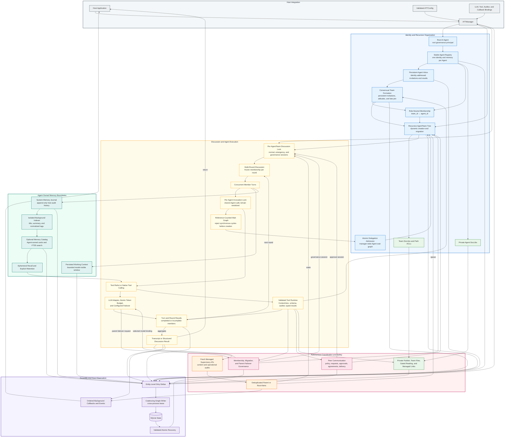

# AI-Team-Team (ATT)

A generic framework for persistent, hierarchical, and dynamically organized multi-agent collaboration in Python.

ATT models stable Agent identities that can participate in autonomous AgentTeams.

Agents can propose teams, participate in structured discussions, communicate across teams, and reorganize recursive topology under explicit system-wide rules.

ATT keeps identity, authority, memory, and team state as separate system concepts as its coordination structure grows.

Many thanks to Gemini and GPT for their help!

> [!NOTE]
> ATT is under active development, so public APIs and persistence schemas may change as the organizational model is refined.
>
> The project already features a lot of really fun and innovative designs, with an even more groundbreaking architecture in the works. \
> (It’s still a little rough around the edges though 👀)

> [!TIP]
> If you notice any issues or have any suggestions and have the time, please leave them in the Issues section. Thank you.

[](#)
[](LICENSE.txt)
[](docs/README.md)
[](#)

## What ATT Is For

ATT is built to let AIs communicate with one another, form teams, and develop organizational structures through their own actions.

The basic idea is simple: every AI remains an independent Agent, and the relationships between Agents and AgentTeams are explicit, autonomous, and changeable.

An Agent can join several AgentTeams without becoming a different Agent. Its identity, memory, model binding, private workspace, and personal messages remain its own.

An AgentTeam is more than a container for model calls. It can conduct discussions, make team-level decisions, communicate with other AgentTeams, create specialized child teams, and reorganize its position under the shared rules defined by ATT.

ATT therefore separates who an Agent is from the teams it joins, and separates what an AgentTeam decides from the individual member who performs an operation.

## What Matters Most in ATT

The central idea in ATT is the combination of independent Agents and autonomous relationships.

Each Agent retains its own identity, memory, model binding, private workspace, and personal state, while Agents and AgentTeams can establish, change, and end organizational relationships through explicit actions and shared institutions.

These two principles determine how ATT handles membership, communication, governance, memory, concurrency, and persistence.

## Design Model

<details>
<summary>Details</summary>

### Agents Are Persistent Identities

An `Agent` represents one persistent participant identified by an immutable UUID across its model invocations and team memberships.

Its name, role, instructions, model binding, Working Context, append-only Journal, optional episodic-memory catalog, invocation lock, lifecycle state, Agent inbox, and Private DocLib belong to that Agent identity.

Joining or leaving an AgentTeam changes only the `team_id ↔ agent_id` membership relationship and does not clone, reset, relabel, or transfer Agent-owned state.

When an Agent belongs to several AgentTeams, model invocations for that identity are serialized so concurrent teams cannot mutate its reusable context at the same time.

Cross-team memory continuity is intentional, while framework-recorded messages, memory sources, and model invocations retain team and discussion provenance so their origins remain inspectable.

### AgentTeams Are Autonomous Coordination Units

An `AgentTeam` represents a group-level coordination unit with its own purpose, members, discussion session lock, inbox, proposals, topology position, DocLib, and governance responsibilities.

The AgentTeam is the subject of inter-team communication requests, Agreements, topology migration, and team-level decisions; an individual Agent performs an operation from the authority of its current invocation-scoped AgentTeam.

Member order, creator identity, role labels, and fallback selection do not create an implicit leader, diplomatic representative, or approval authority.

An AgentTeam may assign internal work to a particular member through prompts, roles, or tasks, but that local division of labor does not change the framework's authorization model.

The Root AI uses the same `Agent` type as every other Agent and becomes an approval principal only where the topology or selected institution explicitly assigns the root-level decision to it.

### Membership Is a Relationship, Not Identity Mutation

Existing Agents enter a proposed AgentTeam through revision-bound invitations rather than being copied or inserted by another participant without consent.

Each invitee may publish `accepted`, `declined`, or `explicitly_ignored`, or may choose `None` to publish no attitude; both `None` and an unprocessed invitation appear externally as `no_response`, and only acceptance makes that identity eligible to join.

A material proposal revision creates immutable history and resets the attitudes of retained invitees because consent to one membership, purpose, or policy is not consent to a different proposal.

The initiating Agent may create an eligible accepted subset when the configured minimum team size is satisfied, may require a final confirmation even after unanimous acceptance, and may define whether nonmembers can request a later join.

Creator-AgentTeam deliberation can prepare a detached proposal draft, but the discussion is advisory and cannot supply consent for an invited Agent or publish a proposal on behalf of the initiator.

### Configuration Defines Shared Institutions

`ATTConfig` defines runtime-wide institutions for communication, migration, failover, tool execution, supervision, memory, persistence-related paths, and resource limits.

Agent-facing tools cannot override the configured sender, communication policy, direction, approval path, or governance subject for an individual request.

Communication can be permissive or approval-governed, but the selected institution applies to every AgentTeam at every topology depth rather than granting different rules implicitly from team position.

Governed requests persist an immutable policy snapshot so a configuration change does not retroactively alter an in-progress decision, while active communication Agreements remain valid until an authorized endpoint revokes them.

Strict configuration validation applies during construction and runtime assignment, including changes made through mutable configuration mappings.

### Topology Supports Local Autonomy and Recursive Composition

AgentTeams form a recursive lineage in which a team may create specialized child teams and, when policy permits, migrate to a different valid parent.

Topology depth limits bound recursive delegation, and cycle detection rejects changes that would place a team below itself or introduce an unsatisfiable shared-Agent wait dependency.

The hierarchy provides routing and governance context, while execution authority remains assigned by explicit relationships and institutions.

Top-level AgentTeams are connected through the Root Agent boundary for governance that explicitly requires a root-level principal, while permissive institutions do not introduce approval solely because a team is deep in the tree.

The rendered topology and expert registry provide current organizational context, while discovery and authorization remain separate operations.

### Concurrency Is Scoped to the State Being Protected

Normal, emergency, supervision-related, and governance discussions for the same AgentTeam share one session lock and therefore execute serially.

Different AgentTeams may discuss concurrently unless they need the same Agent invocation lock or another explicitly shared resource.

AgentTeam structural state uses a separate lock for proposals, ballots, membership mutations, and inbox transitions so short authoritative updates do not hold a discussion lock across unrelated work.

Topology mutations are revalidated under a manager-level lock after any external authorization work and before all parent, child, depth, and registry pointers change atomically.

Persistence uses one exclusive writer manager per SQLite state database and coalesces pending deltas without making disk I/O part of the event-loop critical path.

### Failure Semantics Follow the Type of Decision

An ordinary discussion may retain successful member results when another member cannot complete a turn, record a structured incomplete result, and allow that Agent to participate again in the next round.

Cancellation, manager shutdown, persistence failure, and state-consistency violations remain framework-level failures rather than being converted into ordinary incomplete turns.

Governance operations fail closed: communication approval, migration approval, full-member ballots, and parent failover do not authorize an action from missing, invalid, tied, cancelled, or incomplete decisions.

Indeterminate supervisory results remain distinct from confirmed unhealthy content, and degraded execution remains distinct from content health so operational failure does not become an unsupported judgment about the discussion itself.

Typed tool outcomes distinguish invalid arguments, permission denial, business rejection, transient failure, internal failure, and unknown tools instead of inferring semantics from error-message prefixes.

### Memory and Knowledge Have Explicit Ownership Boundaries

Every Agent owns one Working Context and one append-only system Journal, while optional memory compression maintains a bounded recent-message window and advanced episodic indexing produces Agent-owned retrieval metadata without capturing hidden model reasoning.

Every registered Agent also owns one Private DocLib that follows the identity across team memberships and is unavailable to team ACL grants, public discovery, and managed links.

Private material enters a team workspace only through an explicit publish operation initiated by the owning Agent, and explicit private read observations are removed from reusable cross-team model context after the invocation.

Each AgentTeam owns a separate collaborative DocLib whose paths are protected by live prefix ACL checks, normalized path handling, native-symlink rejection, and managed links that revalidate their target permissions on every access.

Model-facing reads are bounded by decoded content tokens and provide stable continuation coordinates, while trusted host-side reads remain a separate administrative capability.

### Tools and Models Remain Provider-Neutral

Provider credentials and SDK integrations remain host-owned, while ATT accepts model clients or a generator handler, stable model aliases, tools, auditors, and observational callbacks through provider-neutral interfaces.

The framework exposes provider-neutral `Tool` objects with JSON Schemas, validates arguments before execution, and lets provider adapters translate those definitions into their native structured-tool format.

When native tool calling is unavailable, Text ReAct uses a balanced scanner and literal-only argument parser rather than evaluating generated Python expressions.

Configured hard model quotas atomically reserve the estimated prompt and configured maximum output capacity before dispatch, include system instructions and complete tool definitions in that estimate, and settle the reservation from reported or estimated actual usage.

Runtime callables and external connections are deliberately not serialized, so a host must rebind the required clients or generator handler before restoring persisted state.

### Organizational State Is Durable and Auditable

ATT persists stable identities, role-neutral memberships, topology, discussions, Agent and AgentTeam inboxes, proposal revisions, invitation decisions, communication requests, approvals, Agreements, memory records, DocLib metadata, files, ACLs, and token usage as structured state.

Incremental persistence records changed entities and file paths through a single asynchronous writer instead of rewriting the entire organization after every operation.

State restoration is staged and validated before publication, including identity references, topology relationships, governance status combinations, model aliases, memory provenance, and DocLib ownership.

A failed restore leaves the existing manager and managed files unchanged rather than publishing a partially reconstructed runtime.

Schema versions are checked before database definition changes, and incompatible databases are rejected explicitly because the project currently favors unambiguous state semantics over legacy-schema compatibility.

Callbacks remain observational extensions: they are dispatched in order outside the discussion path, and callback delay or failure does not change core business outcomes.

</details>

## Core Commitments

* Each Agent retains one identity and its Agent-owned state across all memberships.
* Each AgentTeam acts as the explicit subject of its discussions, communication, Agreements, and team-level governance.
* Membership changes modify only the relationship between an Agent ID and an AgentTeam ID.
* Authority comes from explicit invocation context, topology, and configured institutions.
* Deliberate Agent memory and work artifacts remain auditable without accessing, inferring, or persisting hidden model reasoning.
* The host owns model providers, credentials, external systems, and domain-specific tools, while ATT defines identity, governance, concurrency, persistence, and security semantics.
* Episodic memory, approval-governed communication, dynamic delegation, and membership voting remain independently optional capabilities.

## Technical Overview

ATT represents dynamic multi-agent topologies as recursive lineages with explicit governance, safety boundaries, and persistent state:

### 🧬 Topology & Lineage Control

* **[Tree-like Lineage Spawning](docs/Dynamic_Delegation.md)**: Spawns recursive child agent teams (`AgentTeam`) at runtime to arbitrary depths, strictly bounded by depth limits to prevent stack overflow.
* **[Autonomous Member Configs](docs/Dynamic_Delegation.md#1-dynamic-spawning-&-lineage-hierarchy)**: Defines dynamic child memberships mapping role presets, custom system instructions, and LLM aliases to shape custom agent personalities.
* **[Dynamic Lineage Migration](docs/Dynamic_Delegation.md)**: Permits active teams to request parent-hierarchy migrations, arbitrated by modular strategies with loop/cycle detection and parent notification logs.
* **[Hierarchical Topology Map](docs/Dynamic_Delegation.md)**: Injects an ASCII-drawn indented tree map of active teams (displaying purposes, status, and progress metrics in real-time) directly into the agent prompt context.
* **[Global Expert Discovery](docs/State_Persistence.md)**: Automatically appends a directory of all active system experts (names, roles, and profiles) into the agent's identity context to facilitate peer discovery.
* **[Shared-Agent Continuity](docs/Consensual_Team_Formation.md)**: One `Agent` may participate in several teams with one identity, one persistent Agent inbox, and complete memory. Invocation-scoped team/discussion context keeps prompts and team-sensitive tools correctly scoped while the agent's own model calls remain serialized.
* **[Resilient Failover Routing](docs/Team_Governance.md#5-token-budget--failover-policies)**: Dynamically hot-swaps exhausted or failing model clients. `"auto"` selects from available bindings; `"parent"` uses an explicit parent AgentTeam ballot or a Root Agent decision and fails closed.

### 🧠 ReAct Loops & Execution Engine

* **Bounded ReAct Loops**: Executes standard Thought/Action/Observation reasoning cycles, capped by max steps to prevent runaway API tokens.
* **Strict Balanced Action Parser**: A character-level scanner handles nested delimiters, quotes, triple quotes, escapes, multiline input, Markdown fences, and Unicode before literal-only argument parsing; malformed or unquoted expressions never execute a tool.
* **[Bounded Memory Compression](docs/State_Persistence.md)**: Automates memory pruning by extracting early conversation turns, calling the agent's LLM to generate a `*** HISTORICAL SUMMARY ARCHIVE ***`, and retaining a bounded high-fidelity window.
* **[Optional Selective Episodic Memory](docs/Selective_Episodic_Memory.md)**: When explicitly enabled, records one deterministic Agent-owned segment per terminal business turn, queues isolated retrieval-metadata indexing in the background, and lets only that Agent search or temporarily recall its own Memory Cards through token-bounded, gap-free continuation coordinates.
* **[LLM Adapter Architecture](docs/Tool_System.md)**: Unifies sync, async, and streaming LLM payloads from various providers (Google, OpenAI, Anthropic) into standard `LLMResponse` and `ToolCall` formats via the `ManagerDefaultClientAdapter`.
* **[Atomic Token Budget Circuit Breakers](docs/Team_Governance.md#5-token-budget--failover-policies)**: Enforces hard per-model quotas by atomically reserving prompt and maximum output capacity before each request, settling provider usage, refunding unused capacity, and routing failover through the same ledger.

### 🗳️ Governance & Inter-Team Communication

* **[Democratic Voting System](docs/Dynamic_Delegation.md#5-team-governance-&-democratic-voting-system)**: Features an asynchronous voting pipeline to add or remove members, requiring unanimous participation and a $\ge 2/3$ agreement majority.
* **Anonymous Voting**: Enforces voter anonymity via `cast_vote(..., public=False)` which masks voter names as `"Anonymous Voter"` in the team prompt context.
* **[Autonomous AgentTeam Communication](docs/Team_Governance.md)**: `ATTConfig.communication` selects permissive, parent-approval, or lineage-approval governance. AgentTeams own requests and agreements; Agents act only from invocation-scoped team authority. No member order or creator identity grants communication authority.

### 🔒 Context Protection & Safety Gates

* **[Token-Bounded File Reading](docs/Gated_Reading.md)**: Limits model-facing reads by the effective model's content-token budget rather than file size or line count, supports exact continuation inside long lines, and rejects stale file cursors.
* **[Collaborative DocLib Storage](docs/Gated_Reading.md#6-document-libraries-doclib)**: Equips teams with built-in document libraries. Access is governed by prefix path ACL permissions (`READ`/`WRITE`) that inherit recursively downward to subdirectories.
* **Private Agent DocLibs**: Gives every registered AI one persistent private workspace (`PDL-<agent_id>`). Private files follow a shared AI across teams, remain outside team ACLs and prompts, and enter a team library only through an explicit copy/publish tool.
* **[Consensual Existing-Agent Membership](docs/Consensual_Team_Formation.md)**: Ordinary Agent and host APIs send revision-bound identity-inbox invitations before adding a registered Agent to a new AgentTeam. Material proposal revisions preserve immutable history and renew consent, while optional detached creator-Team deliberation can shape a structured draft without deciding for invitees. Membership remains a role-neutral relation that never rebinds or clears Agent-owned identity, memory, model, lifecycle, lock, inbox, or Private DocLib state.
* **Tool Auditor Interception**: Registers pre-execution interception hooks to audit, vet, approve, or reject specific tool calls (e.g. database safety query check).

### 💾 Persistence & Diagnostics

* **[Asynchronous SQLite Persistence](docs/State_Persistence.md)**: Serializes changed topology, memory, DocLib, ACL, and governance records through an exclusive cross-process writer lease with one active and one coalesced pending delta, explicit flush, and transactional restore validation.
* **[Supervisory Dialogue Audits](docs/Supervisory_Team.md)**: Each audit creates a short-lived, registered supervisory AgentTeam with fresh Integrity, Continuity, and Deadlock auditors.
  It reviews the discussion through normal team execution, retains durable audit evidence, dissolves the temporary team, and escalates confirmed anomalies up the tree lineage.
* **Decoupled Dashboards**: Dispatches synchronous or asynchronous runtime callbacks (`on_status_change`, `on_activity_added`, `on_log_append`) in order on an isolated background channel, so slow or failing observers cannot block discussions.

## 📦 Installation

ATT requires Python 3.11 or later.

Create or activate a virtual environment in your application project:

```bash
cd your-project
python3 -m venv .venv
source .venv/bin/activate
```

Install ATT directly from the Git repository:

```bash
python -m pip install "ai-team-team @ git+https://github.com/AI-Team-Team/AI-Team-Team.git@main"
```

For reproducible environments, replace `main` with a release tag or commit hash:

```bash
python -m pip install "ai-team-team @ git+https://github.com/AI-Team-Team/AI-Team-Team.git@<tag-or-commit>"
```

Verify the installation:

```bash
python -c "import ai_team_team; print('ATT is available ^_^')"
```

## 🏛️ System Architecture

`ATTManager` connects the host application to stable Agent identities, recursive AgentTeams, serialized discussions, governed tools and communication, protected knowledge, supervision, and durable state:



* [Open the detailed ATT system architecture](docs/flowcharts/System_Architecture.md)
* [Browse all architecture and control-flow diagrams](docs/flowcharts/)

## 🛠️ Getting Started

The complete setup and first-use guide has moved to the [Quickstart Guide](docs/user/Quickstart.md).

The Quickstart now covers manager configuration, LLM integration, model and Agent registration, persistence, custom tools, callbacks, team discussions, migration, governed communication, Native Strategy, and DocLib usage.

## ⚙️ Advanced Configuration

The complete and current `ATTConfig` reference has moved to the [Public API Reference](docs/user/API_Reference.md).

The reference includes every top-level option, nested policy configuration, tokenizer mapping, validation constraint, and the model-facing file-read token-counter rules.

## 📊 Architecture & Control Flow Diagrams

For visual flowcharts and sequencing diagrams detailing the runtime loops, gated checks, and state serialization flows, refer to:

* **[Detailed ATT System Architecture](docs/flowcharts/System_Architecture.md)**
* **[ATT Autonomy Suite Flowcharts Index](docs/flowcharts/README.md)**
* **[Tooling & Execution (Adapters, ReAct, Memory Compression)](docs/flowcharts/Tooling_and_Execution.md)**
* **[State Persistence (SQLite Recovery & ORM Deletions)](docs/flowcharts/State_Persistence.md)**
* **[Autonomous Communication Governance](docs/flowcharts/Autonomous_Communication_Governance.md)**
* **[Lineage Tree Mutations (Spawning, Voting, Migration)](docs/flowcharts/Lineage_Tree_Mutations.md)**
* **[Supervision & Emergencies (3-AI Audits, Emergency Wakeup)](docs/flowcharts/Supervision_and_Emergencies.md)**
* **[Token-Bounded File Reading & DocLib ACL Traversal](docs/flowcharts/Gated_Reading.md)**

## 📄 License

Distributed under the Apache License 2.0. See `LICENSE.txt` for details.
