# AI-Team-Team (ATT)

A lightweight, generic, hierarchical dynamic multi-agent collaboration framework in Python.

Instead of treating AI as isolated chatbots, ATT treats them as members of a living organization.

AI can freely form teams, define how they discuss things with each other, how AI teams discuss things, and create all sorts of incredibly complex hierarchical (or dynamic) relationships.

ATT aims to enable hundreds, thousands, or even tens of thousands of AIs to work together in an orderly manner.

<details>
<summary>More</summary>
ATT empowers AI agents to transition from passive context consumers to active, self-governing groups. It organizes agents into dynamic, tree-like recursive lineages with built-in consensus debates, ReAct reasoning loops, communication permission gating, size-aware file context protection, and supervisory health auditing.
</details>

Many thanks to Gemini and GPT for their help!

> [!NOTE]
> The project already features a lot of really fun and innovative designs, with an even more groundbreaking architecture in the works. \
> (It’s still a little rough around the edges though 👀)

> [!TIP]
> If you notice any issues or have any suggestions and have the time, \
> please leave them in the Issues section. Thank you.

[](#)
[](LICENSE.txt)
[](docs/README.md)
[](#)

The ATT framework organizes dynamic multi-agent topologies into clean, recursive lineages with robust governance, safety gates, and state persistence:

### 🧬 Topology & Lineage Control

* **[Tree-like Lineage Spawning](docs/Dynamic_Delegation.md)**: Spawns recursive child agent teams (`AgentTeam`) at runtime to arbitrary depths, strictly bounded by depth limits to prevent stack overflow.
* **[Autonomous Member Configs](docs/Dynamic_Delegation.md#1-dynamic-spawning-&-lineage-hierarchy)**: Defines dynamic child memberships mapping role presets, custom system instructions, and LLM aliases to shape custom agent personalities.
* **[Dynamic Lineage Migration](docs/Dynamic_Delegation.md)**: Permits active teams to request parent-hierarchy migrations, arbitrated by modular strategies with loop/cycle detection and parent notification logs.
* **[Hierarchical Topology Map](docs/Dynamic_Delegation.md)**: Injects an ASCII-drawn indented tree map of active teams (displaying purposes, status, and progress metrics in real-time) directly into the agent prompt context.
* **[Global Expert Discovery](docs/State_Persistence.md)**: Automatically appends a directory of all active system experts (names, roles, and profiles) into the agent's identity context to facilitate peer discovery.
* **Shared-Agent Continuity**: One `Agent` may participate in several teams with one identity and complete memory. Invocation-scoped team/discussion context keeps prompts and team-sensitive tools correctly scoped while the agent's own model calls remain serialized.
* **[Resilient Failover Routing](docs/Team_Governance.md#5-token-budget--failover-policies)**: Dynamically hot-swaps exhausted or failing model clients. `"auto"` selects from available bindings; `"parent"` uses an explicit parent AgentTeam ballot or a Root Agent decision and fails closed.

### 🧠 ReAct Loops & Execution Engine

* **Bounded ReAct Loops**: Executes standard Thought/Action/Observation reasoning cycles, capped by max steps to prevent runaway API tokens.
* **Strict Balanced Action Parser**: A character-level scanner handles nested delimiters, quotes, triple quotes, escapes, multiline input, Markdown fences, and Unicode before literal-only argument parsing; malformed or unquoted expressions never execute a tool.
* **[Bounded Memory Compression](docs/State_Persistence.md)**: Automates memory pruning by extracting early conversation turns, calling the agent's LLM to generate a `*** HISTORICAL SUMMARY ARCHIVE ***`, and retaining a bounded high-fidelity window.
* **[LLM Adapter Architecture](docs/Tool_System.md)**: Unifies sync, async, and streaming LLM payloads from various providers (Google, OpenAI, Anthropic) into standard `LLMResponse` and `ToolCall` formats via the `ManagerDefaultClientAdapter`.
* **[Atomic Token Budget Circuit Breakers](docs/Team_Governance.md#5-token-budget--failover-policies)**: Enforces hard per-model quotas by atomically reserving prompt and maximum output capacity before each request, settling provider usage, refunding unused capacity, and routing failover through the same ledger.

### 🗳️ Governance & Inter-Team Communication

* **[Democratic Voting System](docs/Dynamic_Delegation.md#5-team-governance-&-democratic-voting-system)**: Features an asynchronous voting pipeline to add or remove members, requiring unanimous participation and a $\ge 2/3$ agreement majority.
* **Anonymous Voting**: Enforces voter anonymity via `cast_vote(..., public=False)` which masks voter names as `"Anonymous Voter"` in the team prompt context.
* **[Autonomous AgentTeam Communication](docs/Team_Governance.md)**: `ATTConfig.communication` selects permissive, parent-approval, or lineage-approval governance. AgentTeams own requests and agreements; Agents act only from invocation-scoped team authority. No member order or creator identity grants communication authority.

### 🔒 Context Protection & Safety Gates

* **[Gated Context Protection](docs/Gated_Reading.md)**: Restricts direct large file reads; falls back to Outline Warnings with a 5-line sample of files exceeding 50 KB, prompting agents to make paginated, sliced chunk requests.
* **[Collaborative DocLib Storage](docs/Gated_Reading.md#5-document-libraries-doclib)**: Equips teams with built-in document libraries. Access is governed by prefix path ACL permissions (`READ`/`WRITE`) that inherit recursively downward to subdirectories.
* **Private Agent DocLibs**: Gives every registered AI one persistent private workspace (`PDL-<agent_id>`). Private files follow a shared AI across teams, remain outside team ACLs and prompts, and enter a team library only through an explicit copy/publish tool.
* **Tool Auditor Interception**: Registers pre-execution interception hooks to audit, vet, approve, or reject specific tool calls (e.g. database safety query check).

### 💾 Persistence & Diagnostics

* **[Asynchronous SQLite Persistence](docs/State_Persistence.md)**: Serializes changed topology, memory, DocLib, ACL, and governance records through an exclusive cross-process writer lease with one active and one coalesced pending delta, explicit flush, and transactional restore validation.
* **[Supervisory Dialogue Audits](docs/Supervisory_Team.md)**: A non-participating 3-AI Supervisory Team executes parallel LLM evaluations (Integrity Auditor, Continuity Auditor, Deadlock Auditor) to review round transcripts, recursively escalating anomalies up the tree lineage.
* **Decoupled Dashboards**: Dispatches synchronous or asynchronous runtime callbacks (`on_status_change`, `on_activity_added`, `on_log_append`) in order on an isolated background channel, so slow or failing observers cannot block discussions.

## 📦 Installation

To install in editable mode for local developer workspace sync, it is recommended to set up a virtual environment:

```bash
# Clone the repository
git clone https://github.com/AI-Team-Team/AI-Team-Team.git
cd AI-Team-Team

# Create and activate virtual environment
python3 -m venv venv
source venv/bin/activate

# Install in editable/dev mode (quotes are required in zsh/macOS)
pip install -e ".[dev]"
```

To install directly as a Git dependency in your own project:

```bash
pip install git+https://github.com/AI-Team-Team/AI-Team-Team.git@main
```

## 🏛️ System Architecture

The master `ATTManager` coordinates identity, topology, execution, governance, knowledge, supervision, persistence, and host integration:

```mermaid
flowchart TB
    subgraph Host["Host Runtime & Configuration"]
        HostApp["Host Application"] --> Manager["ATTManager"]
        Config["Validated ATTConfig<br/>communication, migration, failover,<br/>limits, tools, audit, workspace"] --> Manager
        Bindings["Runtime Bindings<br/>LLM clients, model aliases,<br/>generator handler, custom tools"] --> Manager
        Manager --> CallbackQueue["Ordered Background Callbacks<br/>sync or async observers"]
        CallbackQueue --> HostApp
    end

    subgraph Organization["Identity & Recursive AgentTeam Topology"]
        Root["Root AI<br/>Agent identity and root governance principal"]
        AgentRegistry["Stable Agent UUID Registry<br/>active, retained, archived"]
        TeamRegistry["AgentTeam Registry<br/>parent/child topology at arbitrary depth"]
        Delegation["Dynamic Delegation & Child Spawning<br/>bounded by configured depth and team size"]
        TopTeam["Top-Level AgentTeam"] --> ChildTeam["Child AgentTeam"]
        ChildTeam --> Descendant["Descendant AgentTeam"]
        SharedAgent["Shared Agent<br/>one identity across multiple AgentTeams"]
        SharedMemory["Continuous Agent Memory<br/>team_id and discussion_id provenance"]
        Lifecycle["Agent Lifecycle<br/>retain, archive, confirmed delete"]

        AgentRegistry --> SharedAgent
        SharedAgent --> TopTeam
        SharedAgent --> ChildTeam
        SharedAgent --> SharedMemory
        AgentRegistry --> Lifecycle
        Delegation --> TeamRegistry
        TeamRegistry --> TopTeam
        Root --> TopTeam
    end

    subgraph Execution["Serialized Discussions & Agent Execution"]
        Discussion["AgentTeam Discussion<br/>normal, emergency, governance"] --> TeamLock["Per-AgentTeam discussion_lock"]
        TeamLock --> AgentTurn["Member Reasoning Turns"]
        ActiveContext["Invocation ContextVars<br/>active Agent, AgentTeam, discussion, tool call"] --> AgentTurn
        AgentTurn --> AgentLock["Per-Agent invocation lock"]
        AgentLock --> Strategy{"Reasoning Strategy"}
        Strategy --> TextReAct["Bounded Text ReAct"]
        Strategy --> Native["Native Structured Tool Calling"]
        TextReAct --> Adapter["LLM Adapter Layer"]
        Native --> Adapter
        Adapter --> TokenLedger["Atomic Token Reservation & Settlement"]
        TokenLedger --> ModelCall["Bound Model / Provider Call"]
        TextReAct --> ToolRuntime["Built-in & Custom Tool Runtime"]
        Native --> ToolRuntime
        ToolRuntime --> ToolAudit["ToolAuditor Gate"]
        ToolAudit --> ToolValidation["Signature, Pydantic & JSON Schema Validation"]
        ToolValidation --> ToolResult["Structured ToolResult<br/>status, error kind, attempts"]
        ToolResult --> TurnResult["AgentTurnResult<br/>completed or incomplete"]
        TurnResult --> RoundResult["DiscussionRoundResult"]
        RoundResult --> SharedMemory
        MemoryWindow["Bounded Model Window<br/>compression, team-aware retrieval"] --> AgentTurn
        SharedMemory --> MemoryWindow
    end

    subgraph Governance["Autonomous Governance & Resource Control"]
        Membership["Membership Proposals & Atomic Voting"]
        CommConfig{"Communication Institution<br/>permissive, parent approval,<br/>lineage approval"}
        Broker["NegotiationBroker<br/>requests, approvals, agreements, delivery"]
        CommRequest["Persistent CommunicationRequest<br/>policy snapshot and explicit principals"]
        CommDecision["Communication Principal Decision<br/>AgentTeam ballot or explicit Agent decision"]
        Agreement["Directional CommunicationAgreement<br/>active until endpoint revocation"]
        PeerDelivery["Durable Peer Message<br/>idempotent inbox delivery"]
        RecipientInbox["Recipient AgentTeam Inbox"]
        Migration["Migration Policy<br/>permissive, ancestor approval, lineage path"]
        MigrationDecision["Migration Principal Decision<br/>AgentTeam ballot or Root Agent decision"]
        TopologyCommit["Topology Lock<br/>revalidate and atomically relink"]
        Failover["Failover Policy<br/>auto, parent, none"]
        ResourceDecision["Parent AgentTeam Ballot<br/>or Root Agent Decision"]

        CommConfig --> Broker
        Broker -->|permissive| PeerDelivery
        Broker -->|approval required| CommRequest
        CommRequest --> CommDecision
        CommDecision --> Agreement
        Agreement --> PeerDelivery
        PeerDelivery --> RecipientInbox
        Migration -->|governed| MigrationDecision
        Migration -->|permissive| TopologyCommit
        MigrationDecision --> TopologyCommit
        Failover -->|parent| ResourceDecision
        ResourceDecision --> ModelCall
        Failover -->|auto| ModelCall
    end

    subgraph Knowledge["Team Knowledge & Private Agent Workspaces"]
        TeamDocLib["Built-in Team DocLib"]
        PrivateDocLib["Private Agent DocLib<br/>one persistent workspace per Agent"]
        ACL["Real-Time Team Path ACL<br/>READ / WRITE"]
        PrivateOwner["Active Agent Ownership Check"]
        GatedReader["Gated Reading<br/>outline and bounded line windows"]
        ManagedLinks["Managed Cross-Library File Links<br/>live ACL checks"]
        Publish["Explicit Private-to-Team Publish<br/>copy, never implicit disclosure"]

        TopTeam --> TeamDocLib
        ChildTeam --> TeamDocLib
        SharedAgent --> PrivateDocLib
        ACL --> TeamDocLib
        TeamDocLib --> GatedReader
        TeamDocLib --> ManagedLinks
        ManagedLinks -->|target access| ACL
        PrivateOwner --> PrivateDocLib
        PrivateDocLib --> Publish
        Publish -->|target access| ACL
    end

    subgraph Supervision["Supervision, Alerts & Emergency Handling"]
        Audit["3-Agent Supervisory Audit"] --> AuditStatus{"Content AuditStatus"}
        Discussion --> OperationalStatus{"OperationalStatus<br/>healthy, degraded, unknown"}
        AuditStatus -->|HEALTHY| Complete["Discussion Result"]
        AuditStatus -->|UNHEALTHY| Alert["Confirmed Anomaly Alert"]
        AuditStatus -->|UNKNOWN| Unknown["Deduplicated Persistent UNKNOWN Alert"]
        Alert --> ParentInbox["Parent AgentTeam Inbox"]
        Unknown --> ParentInbox
        OperationalStatus -->|degraded| OperationalAlert["Deduplicated Operational Alert"]
        OperationalAlert --> ParentInbox
        ParentInbox --> AlertMode{"Queue or Wake"}
        AlertMode -->|queue| NextDiscussion["Next Normal Discussion"]
        AlertMode -->|wake| Emergency["Serialized Emergency Discussion"]
        Alert -->|root-level| RootEvent["Root System Event / Callback"]
        Unknown -->|root-level| RootEvent
    end

    subgraph Persistence["Asynchronous Incremental Persistence & Recovery"]
        DomainChanges["Entity-Level Copy-on-Write Deltas<br/>identity, topology, memory, inbox,<br/>governance, DocLib, ACL, token usage"]
        Coordinator["Single-Writer Coordinator<br/>one active plus one coalesced pending delta"]
        Lease["Cross-Process Writer Lease"]
        SQLite[(SQLite Schema 6<br/>foreign keys, WAL, busy timeout)]
        Restore["Detached Restore Staging"]
        Validation["Strict Reference & Invariant Validation"]
        PublishState["Atomic Runtime and DocLib Publication"]

        DomainChanges --> Coordinator
        Lease --> Coordinator
        Coordinator --> SQLite
        SQLite --> Restore
        Restore --> Validation
        Validation --> PublishState
        PublishState --> Manager
    end

    Manager --> Root
    Manager --> AgentRegistry
    Manager --> TeamRegistry
    Manager --> Discussion
    Manager --> ActiveContext
    Bindings --> Adapter
    Config --> CommConfig
    Config --> Migration
    Config --> Failover
    ToolRuntime --> Membership
    ToolRuntime -->|spawn child| Delegation
    ToolRuntime --> Broker
    ToolRuntime --> Migration
    ToolRuntime -->|team files| ACL
    ToolRuntime -->|private files| PrivateOwner
    Lifecycle --> PrivateDocLib
    Discussion --> Audit
    Descendant -->|task or anomaly escalation| ParentInbox
    RecipientInbox -->|next scheduled discussion| Discussion
    Emergency --> Discussion
    NextDiscussion --> Discussion
    TokenLedger -->|quota exhausted| Failover
    Membership --> TeamRegistry
    TopologyCommit --> TeamRegistry
    CommDecision -.-> TeamLock
    CommDecision -.-> AgentLock
    MigrationDecision -.-> TeamLock
    MigrationDecision -.-> AgentLock
    ResourceDecision -.-> TeamLock
    ResourceDecision -.-> AgentLock
    TeamRegistry --> DomainChanges
    AgentRegistry --> DomainChanges
    SharedMemory --> DomainChanges
    Membership --> DomainChanges
    Broker --> DomainChanges
    TopologyCommit --> DomainChanges
    TeamDocLib --> DomainChanges
    PrivateDocLib --> DomainChanges
    ParentInbox --> DomainChanges
    TokenLedger --> DomainChanges

    classDef coordinator fill:#eceff1,stroke:#37474f,stroke-width:2px;
    classDef identity fill:#e3f2fd,stroke:#1976d2,stroke-width:1.5px;
    classDef execution fill:#fffde7,stroke:#f9a825,stroke-width:1.5px;
    classDef governance fill:#fce4ec,stroke:#c2185b,stroke-width:1.5px;
    classDef knowledge fill:#e8f5e9,stroke:#388e3c,stroke-width:1.5px;
    classDef supervision fill:#fff3e0,stroke:#ef6c00,stroke-width:1.5px;
    classDef persistence fill:#ede7f6,stroke:#5e35b1,stroke-width:1.5px;

    style Host fill:#f4f7f9,stroke:#455a64,stroke-width:2px,color:#1f2937;
    style Organization fill:#eff6ff,stroke:#1976d2,stroke-width:2px,color:#1f2937;
    style Execution fill:#fffbeb,stroke:#f9a825,stroke-width:2px,color:#1f2937;
    style Governance fill:#fff1f2,stroke:#c2185b,stroke-width:2px,color:#1f2937;
    style Knowledge fill:#f0fdf4,stroke:#388e3c,stroke-width:2px,color:#1f2937;
    style Supervision fill:#fff7ed,stroke:#ef6c00,stroke-width:2px,color:#1f2937;
    style Persistence fill:#f5f3ff,stroke:#5e35b1,stroke-width:2px,color:#1f2937;

    class Manager,Config,Bindings,CallbackQueue coordinator;
    class Root,AgentRegistry,TeamRegistry,Delegation,TopTeam,ChildTeam,Descendant,SharedAgent,SharedMemory,Lifecycle identity;
    class Discussion,TeamLock,AgentTurn,ActiveContext,AgentLock,Strategy,TextReAct,Native,Adapter,TokenLedger,ModelCall,ToolRuntime,ToolAudit,ToolValidation,ToolResult,TurnResult,RoundResult,MemoryWindow execution;
    class Membership,CommConfig,Broker,CommRequest,CommDecision,Agreement,PeerDelivery,RecipientInbox,Migration,MigrationDecision,TopologyCommit,Failover,ResourceDecision governance;
    class TeamDocLib,PrivateDocLib,ACL,PrivateOwner,GatedReader,ManagedLinks,Publish knowledge;
    class Audit,AuditStatus,OperationalStatus,OperationalAlert,Complete,Alert,Unknown,ParentInbox,AlertMode,NextDiscussion,Emergency,RootEvent supervision;
    class DomainChanges,Coordinator,Lease,SQLite,Restore,Validation,PublishState persistence;
```



## 🛠️ Getting Started

### 1. Initialize Configuration & Manager

```python
from typing import Union, List, Dict, Optional
from ai_team_team import ATTManager, Agent, ATTConfig

# 1. Configure the framework
config = ATTConfig(
    enable_dynamic_delegation=True,
    max_delegation_depth=2,
    min_subagent_team_size=3,
    subagent_discussion_rounds=2,
    react_max_steps=5,
    enable_memory_compression=True,       # Retains a bounded recent-message window
    failover_policy="auto",               # Automatically hot-swaps LLM client on TokenLimitError
    enable_emergency_wakeup=True,         # Enables deferred inbox processing for emergencies
    tool_calling_mode="auto",             # Auto-detects Pluggable Reasoning Strategy (Native or TextReAct)
    audit_unknown_escalation_mode="wake", # Or "queue"
    agent_private_data_policy="archive"   # Or "retain" / "delete"
)

# 2. Setup Root Agent (client is dynamically resolved if omitted)
root_agent = Agent(name="Root_AI", role="Architect")

# 3. Create Manager with SQLite State Snapshotting enabled
# All actions, tool calls, and debates will auto-save to this file
manager = ATTManager(root_ai=root_agent, config=config, db_path="att_state.db")

# 4. Register a global generator callback handler before loading state
# All LLM invocation logic is delegated here, keeping the framework keyless and SDK-independent
async def my_handler(
    model_name: str,
    prompt: Union[str, List[Dict[str, str]]],
    system_instruction: Optional[str] = None,
    max_output_tokens: Optional[int] = None,
    temperature: float = 0.3,
    require_json: bool = False
) -> str:
    # 1. Inspect model_name to call the correct provider/SDK
    # 2. If require_json=True is requested, return valid JSON string
    return "Final Answer: Processed successfully."

manager.register_generator_handler(my_handler)

# 5. Persistence APIs are asynchronous
# if os.path.exists("att_state.db"):
#     await manager.load_state("att_state.db")
# await manager.save_state("att_backup.db")
# await manager.flush_state()
# await manager.close()
```

Direct client objects must have one stable identity binding before state is saved.

A client's `model_name` attribute is not accepted unless that same object is registered under the name:

```python
manager.register_llm_client("analysis", analysis_client)
```

Every manager registration creates exactly one private DocLib for the stable Agent UUID.

External agents should use the supported registration API:

```python
researcher = Agent("Researcher", "Evidence analyst", analysis_client)
manager.register_agent(researcher)
private_id = manager.get_private_library_id(researcher.agent_id)

# Lifecycle APIs are asynchronous and preserve the same identity/library.
await manager.retire_agent(researcher.agent_id)  # Default: archive.
await manager.reactivate_agent(researcher.agent_id, "analysis")
```

#### 🔌 LLM Client Interface (`LLMClientProto`)

To integrate custom LLM backends (e.g., Google GenAI, OpenAI, Anthropic, or local inference engines), the supplied client must conform to the following signature:

```python
from typing import Optional, Protocol, Union, List, Dict, Any
from ai_team_team import Tool

class LLMResponse:
    text: str
    tool_calls: Optional[List[Dict[str, Any]]]

class LLMClientProto(Protocol):
    async def generate(
        self,
        prompt: Union[str, List[Dict[str, Any]]],
        system_instruction: Optional[str] = None,
        tools: Optional[List[Tool]] = None,
        max_output_tokens: Optional[int] = None,
        temperature: float = 0.7,
        require_json: bool = False
    ) -> LLMResponse:
        """
        Generates a text completion or returns structured tool calls.
        When require_json=True is requested by SupervisoryTeam consensus audits,
        the model must return a valid, parsable JSON string via the LLMResponse.text property.
        """
        ...

    def supports_native_tool_calling(self) -> bool:
        """
        Returns True if the client/model configuration natively supports structured function calling.
        """
        ...

    def supports_output_token_limit(self) -> Union[bool, str]:
        """Returns the supported hard-quota parameter name when available."""
        ...
```

### 2. Register Presets & Custom Tools

Presets and custom tools are registered dynamically at runtime to keep the package generic:

```python
# Register custom presets
manager.register_preset(
    name="analysts",
    description="Refines requirements and specs",
    system_instructions="Deconstruct tasks into clear constraints.",
    roles=[
        ("Integrity_Analyst", "Checks logic compliance"),
        ("Structural_Planner", "Optimizes flow and layouts"),
        ("Arbitrator", "Synthesizes final answer")
    ]
)

# Register custom tools
# The manager supports automatic name and description derivation:
# 1. Automatic derivation from function name and docstring (recommended):
def query_db(sql_command: str):
    """Run safe SQL commands directly on the DB. Arguments: sql_command (str)"""
    return "Query result..."

manager.register_tool(query_db)

# 2. Or explicit/manual registration:
manager.register_tool(
    name="query_db",
    description="Run safe SQL commands directly on the DB. Arguments: sql_command (str)",
    func=query_db
)
```

#### 💡 Tool Argument Convention & Parameter Discovery

ReAct agents learn about available tools by inspecting the registered `description`. To ensure agents pass arguments correctly:

1. Include explicit argument name and type guidelines in the description string (e.g., `Arguments: query_text (str), limit (int)`).
2. The framework parses ReAct actions using `ast.literal_eval`. Agents can output actions using standard Python argument syntax:
   * `Action: query_db(sql_command="SELECT * FROM characters")`
   * `Action: search_faiss("Iris character profile", limit=3)`

#### 🔗 Autonomous AgentTeam Communication

Dynamic teams use one system-wide communication institution. The default is permissive at every topology depth:

```python
from ai_team_team import ATTConfig, ParentApprovalCommunicationConfig

config = ATTConfig(
    communication=ParentApprovalCommunicationConfig(
        request_delivery="queue",
        direction="bidirectional",
    )
)
```

* **Request a governed channel**: `Action: request_peer_communication(team_id="AT-xyz789", rationale="Coordinate the audit")`
* **Inter-Team Messaging**: Under permissive policy, messages deliver directly. Under an approval policy, the same action requires an active Agreement:
  `Action: send_peer_message(team_id="AT-xyz789", message="Verify character status of Iris")`
* **Revoke a channel**: Either endpoint AgentTeam may call `revoke_peer_agreement(agreement_id, reason)`.
* **Authority**: The calling Agent must be an active member of the invocation-scoped AgentTeam. Tools never accept a sender, policy, direction, or approval-principal override.
* **Parent Escalation**: If an agent hits a depth gate or lacks permissions, they escalate issues upward:
  `Action: delegate_escalation(objective="Failed to verify rule consistency", rationale="Depth limit reached")`
  The parent team automatically consumes and summarizes these inbox alerts during their next active turn.

### 3. Bind Tool Auditor (Security Hook)

Intercept tool execution transparently before running to check rules or safety:

```python
def audit_db_query(*args, **kwargs) -> tuple[bool, str]:
    sql = args[0] if args else kwargs.get("sql_command")
    if "DROP" in sql.upper():
        return False, "Dangerous DROP command blocked."
    return True, "Safe query"

manager.register_tool_auditor("query_db", audit_db_query)
```

### 4. Setup Event Hooks (UI / Logging)

Connect your terminal console dashboard (e.g. `rich.live`), custom file loggers, and team migration updates using callbacks:

```python
# Wire status display updates
manager.on_status_change = lambda name, status: my_dashboard.update_agent_status(name, status)
manager.on_activity_added = lambda name, act_type, content: my_dashboard.add_log(name, act_type, content)

# Wire logging callback
def my_log_callback(team_id, title, content, chapter_num):
    my_file_logger.write(f"[{team_id}] {title}\n{content}")
    
manager.on_log_append = my_log_callback

# Wire team migration callback
def my_migration_callback(team_id, old_parent_id, new_parent_id):
    print(f"Team {team_id} moved from {old_parent_id} to {new_parent_id}")

manager.on_team_migration = my_migration_callback

# Wire emergency escalation callback
def my_emergency_callback(team_id, alert_type, alert_reason):
    print(f"[EMERGENCY ALERT] Team {team_id} encountered {alert_type}: {alert_reason}")

manager.on_emergency_escalation = my_emergency_callback

# Callbacks may also be async. Tests and hosts that need an observation barrier
# can explicitly wait for all callbacks queued so far.
await manager.flush_callbacks()
```

### 5. Spawn Team & Execute Discussion

```python
# Spawn dynamic level 1 team using analysts preset
team = manager.create_agent_team(
    creator=root_agent,
    member_count=3,
    preset_name="analysts",
    team_purpose="Audit the system logic mapping for project A."
)

# Run cooperative multi-round debate
transcript = await manager.execute_team_discussion(
    team=team,
    prompt="Audit the system logic mapping for project A.",
    rounds=2
)
print("Debate result:", transcript)

# Use the detailed API when the host needs partial-turn and audit metadata.
detailed = await manager.execute_team_discussion_detailed(
    team=team,
    prompt="Audit the system logic mapping for project A.",
    rounds=2,
)
print(detailed.status, detailed.rounds, detailed.audit)
```

### 6. Dynamic Team Migration & Topology Tree

ATT supports dynamic lineage migration, allowing active teams to request hierarchy updates at runtime. You can also print the active tree hierarchy:

```python
# Print the current active lineage hierarchy as an indented ASCII tree
tree_representation = manager.render_topology_tree()
print(tree_representation)
# Outputs:
# - [Root AI: Root_AI] (Level 0)
#   ├── AT-abc123 (Purpose: Audit the system logic mapping for project A.) [Level 1]
#   │    └── AT-def456 (Purpose: Security Check) [Level 2]
#   └── AT-xyz789 (Purpose: Docs Generation) [Level 1]
```

### 7. Approval-Governed P2P Communication

Select the institution once in `ATTConfig`. Every AgentTeam, regardless of depth, follows the same policy:

```python
from ai_team_team import ATTConfig, LineageApprovalCommunicationConfig

config = ATTConfig(
    communication=LineageApprovalCommunicationConfig(
        request_delivery="wake",
        direction="one_way",
    )
)

# The calling Agent cannot override these choices and requests a channel from its current invocation-scoped AgentTeam.
# Action: request_peer_communication(team_id="AT-def456", rationale="Share findings")
```

### 8. Native Strategy (Structured Tool Calling)

By default, ATT uses `tool_calling_mode="auto"`.

Only a literal `True` from the synchronous capability probe selects Native mode; probe errors, awaitables, and non-boolean values emit a system event and fall back to Text ReAct.

Provider adapters receive `List[Tool]` and are responsible for converting each `Tool.json_schema` to the provider SDK format.

```python
# 1. Force native structured tool calling
config.tool_calling_mode = "native"

# 2. Ensure your model is registered as supporting native tools
manager.register_model("gpt-5.6-sol", {
    "supports_native_tool_calling": True
})

# Under the hood, ManagerDefaultClientAdapter will route tools as JSON schemas
# and execute returned ToolCalls concurrently via asyncio.gather.
```

## ⚙️ Advanced Configuration

### `ATTConfig` Parameters

Configure `ATTConfig` to fine-tune the multi-agent debate loop, depth boundaries, and latency profiles:

| Configuration Property | Type | Default Value | Description |
| :--- | :--- | :--- | :--- |
| `enable_dynamic_delegation` | `bool` | `True` | Whether to allow agents to spawn child sub-teams (Level $N$ panels). |
| `max_delegation_depth` | `int` | `2` | The maximum hierarchy depth limit of recursive dynamic subagent spawning lineages. |
| `min_subagent_team_size` | `int` | `3` | The minimum number of members allowed when initiating a dynamic team panel. |
| `subagent_discussion_rounds` | `int` | `2` | The number of debate discussion rounds executed during dynamic child subagent calls. |
| `react_max_steps` | `int` | `5` | The reasoning step limit capped per agent turn to prevent infinite ReAct loops. |
| `inbox_summarize_threshold_chars` | `int` | `1500` | The text character threshold above which unread inbox alerts are summarized. |
| `model_registry` | `dict` | `{}` | Mapping of specialized agent roles to specific LLM models or endpoints. |
| `max_migrations_per_team_discussion` | `int` | `1` | The maximum hierarchy migration requests a team can execute during a single discussion session. |
| `enable_membership_voting` | `bool` | `False` | Whether to enable the optional democratic membership voting system. |
| `llm_max_retries` | `int` | `3` | Number of retries after the initial LLM attempt. `0` performs one attempt without retrying. |
| `llm_retry_backoff_factor` | `float` | `1.5` | Initial exponential-backoff delay. `0` retries immediately. Only typed/provider-classified transient failures are retried. |
| `enable_memory_compression` | `bool` | `True` | Whether to enable automatic dialogue compression/pruning of early conversation turns. |
| `max_memory_turns` | `int` | `20` | The maximum number of conversation messages (turns) retained as high-fidelity context before summarizing older turns. |
| `communication` | `CommunicationConfig` | `PermissiveCommunicationConfig()` | Strict discriminated configuration: permissive, parent approval, or lineage approval. Approval configurations also define `request_delivery` (`"queue"`/`"wake"`) and `direction` (`"one_way"`/`"bidirectional"`). |
| `migration_policy` | `str` | `"ancestor_approval"` | The strategy used for dynamic lineage migration authorization. Options: `"permissive"`, `"ancestor_approval"`, `"lineage_path"`. |
| `enable_emergency_wakeup` | `bool` | `True` | Whether to trigger active wake-up discussion on idle parent teams upon receiving high-priority child anomalies. |
| `emergency_discussion_rounds` | `int` | `1` | The number of emergency discussion rounds executed when a team is woken up. |
| `tool_calling_mode` | `str` | `"auto"` | Strategy for invoking tools. `"native"`, `"react"`, or `"auto"`. |
| `max_tool_rounds` | `int` | `5` | Max depth of native parallel tool calls during a reasoning step. |
| `max_tool_argument_retries` | `int` | `3` | Model correction opportunities after the first unknown-tool, parse, or validation failure. A Native parallel batch consumes at most one opportunity. |
| `max_tool_execution_retries` | `int` | `2` | Extra execution attempts available to eligible typed transient failures. |
| `tool_execution_retry_policy` | `str` | `"never"` | Execution replay policy: `"never"`, `"retry_safe"`, or `"typed_transient"`. |
| `tool_execution_retry_backoff_factor` | `float` | `0.5` | Initial exponential delay for eligible execution retries; `0` retries immediately. |
| `text_tool_schema_mode` | `str` | `"compact"` | Text prompt schema rendering: `"compact"`, `"full"`, or `"compact_with_examples"`. |
| `tool_prompt_modes` | `dict` | `{}` | Per-tool prompt schema mode overrides. |
| `turn_failure_policy` | `TurnFailurePolicyConfig` | `tool="isolate", llm="isolate"` | Controls whether member-scoped tool or LLM failures isolate the current turn or abort the discussion. |
| `operational_status_decision_mode` | `str` | `"framework"` | Chooses framework, supervisor, or framework-then-supervisor runtime-health determination. |
| `operational_degraded_escalation_mode` | `str` | `"none"` | Routes degraded runtime alerts as no parent escalation, queue, or wake. |
| `model_token_limits` | `dict` | `None` | Mapping of model aliases to hard token quotas; `0` disables that model's quota entirely. |
| `model_max_output_tokens` | `dict` | `None` | Per-model maximum output reservation/request cap used by the atomic hard-quota ledger. |
| `default_max_output_tokens` | `int` | `1024` | Default maximum output reservation when a model-specific cap is absent. |
| `model_tokenizer_configs` | `dict` | `{}` | Mapping of model aliases to tokenizer names or tokenizer JSON files used for prompt-token accounting. The `tokenizers` package is a required runtime dependency. |
| `failover_policy` | `str` | `"auto"` | Fallback strategy on token exhaustion: `"auto"` (next available) or `"parent"` (explicit parent AgentTeam/Root Agent governance). |
| `parent_failover_timeout_seconds` | `float` | `120` | Positive timeout for parent-governed model selection; failures close without automatic fallback. |
| `audit_unknown_escalation_mode` | `str` | `"wake"` | Handling for indeterminate audits: immediately `"wake"` the parent or only `"queue"` the alert. |
| `audit_unknown_soft_threshold` | `int` | `100` | Soft operational warning threshold for unique UNKNOWN alerts; alerts are never dropped or expired automatically. |

### `GatedFileReader` Parameters

Configure file reading gates to safeguard the prompt context from massive logs or code databases:

| Configuration Property | Type | Default Value | Description |
| :--- | :--- | :--- | :--- |
| `large_threshold_kb` | `int` | `50` | File size limit triggering an outline warning if no line boundaries are provided. |
| `max_chunk` | `int` | `100` | Capped line slice count returned per paginated chunk request. |

## 📊 Architecture & Control Flow Diagrams

For visual flowcharts and sequencing diagrams detailing the runtime loops, gated checks, and state serialization flows, refer to:

* **[ATT Autonomy Suite Flowcharts Index](docs/flowcharts/README.md)**
* **[Tooling & Execution (Adapters, ReAct, Memory Compression)](docs/flowcharts/Tooling_and_Execution.md)**
* **[State Persistence (SQLite Recovery & ORM Deletions)](docs/flowcharts/State_Persistence.md)**
* **[Autonomous Communication Governance](docs/flowcharts/Autonomous_Communication_Governance.md)**
* **[Lineage Tree Mutations (Spawning, Voting, Migration)](docs/flowcharts/Lineage_Tree_Mutations.md)**
* **[Supervision & Emergencies (3-AI Audits, Emergency Wakeup)](docs/flowcharts/Supervision_and_Emergencies.md)**
* **[Gated Paginator Reading & DocLib ACL Traversal](docs/flowcharts/Gated_Reading.md)**

## 📄 License

Distributed under the Apache License 2.0. See `LICENSE.txt` for details.
