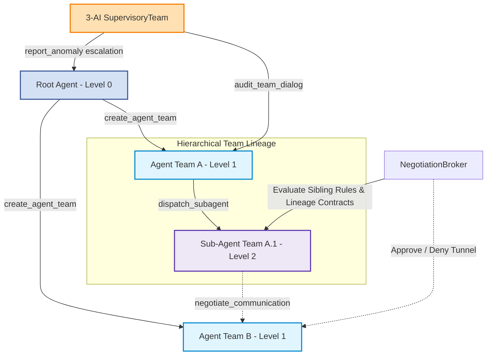

# AI-Team-Team (ATT)

A lightweight, generic, hierarchical dynamic multi-agent collaboration framework in Python.

This allows AIs to freely form teams, define how they discuss things with each other, how AI teams discuss things, and create all sorts of incredibly complex hierarchical (or dynamic?) relationships.

Hundreds, thousands, even tens of thousands of AIs work together in an orderly manner.

`AI-Team-Team` (ATT) empowers AI agents to transition from passive context consumers to active, self-governing groups. It organizes agents into dynamic, tree-like recursive lineages with built-in consensus debates, ReAct reasoning loops, communication permission gating, size-aware file context protection, and supervisory health auditing.

> [!NOTE]
> The project already features a lot of really fun and innovative designs, with an even more groundbreaking architecture in the works. \
> (It’s still a little rough around the edges though 👀)

> [!TIP]
> If you notice any issues or have any suggestions and have the time, \
> please leave them in the Issues section. Thank you.

## 🚀 Key Features

* **Tree-like Lineage Spawning**: Spawns hierarchical dynamic agent teams (`AgentTeam`) recursively from a root agent down to grandchild sub-teams, strictly governed by depth limits.
* **Dynamic presets & Committees**: Allows runtime registration of custom agent committees (role configurations and system prompts) like planning, writing, database management, etc.
* **Bounded ReAct Loops**: Agents execute reasoning steps using standard ReAct (Thought/Action/Observation) protocols, supported by a safe literal argument parser.
* **Negotiation Broker**: Gates sibling and cross-lineage peer-to-peer communication through dynamic permission rules and broker contracts.
* **Tool Auditor Interception Hook**: Allows host applications to register pre-execution callback hooks to audit, approve, or reject specific tool calls (e.g. database safety query vetting).
* **Supervisory Dialogue Audits**: A 3-AI Supervisory Team audits dialogue transcripts for logical deadlocks, circular reasoning, and anomalies, recursively escalating alerts up the ancestry lineage.
* **UI/Logging Decoupling**: Exposes clear runtime event hooks (`on_status_change`, `on_activity_added`, `on_log_append`) to update terminal dashboards and write logs without framework pollution.
* **Gated Context Protection**: Employs `GatedFileReader` to paginate file reading, cap line window requests, and fallback to outline warnings on large documents.

## 📦 Installation

To install in editable mode for local developer workspace sync:

```bash
pip install -e .
```

To install directly as a Git dependency:

```bash
pip install git+https://github.com/AI-Team-Team/AI-Team-Team.git@main
```

## 🏛️ System Architecture

The master `ATTManager` coordinates the lifecycle, communications, and supervision of dynamic agent teams:



## 🛠️ Getting Started

### 1. Initialize Configuration & Manager

```python
from ai_team_team import ATTManager, Agent, ATTConfig, GatedFileReader

# 1. Configure the framework
config = ATTConfig(
    enable_dynamic_delegation=True,
    max_delegation_depth=2,
    min_subagent_team_size=3,
    subagent_discussion_rounds=2,
    react_max_steps=5
)

# 2. Setup LLM client and Root Agent
# llm_client should implement `LLMClientProto` interface (def generate(...))
root_agent = Agent(name="Root_AI", role="Architect", llm_client=my_llm_client)

# 3. Create Manager
manager = ATTManager(root_ai=root_agent, critic_client=my_llm_client, config=config)
```

### 2. Register Presets & Custom Tools

Presets and custom tools are registered dynamically at runtime to keep the package generic:

```python
# Register custom presets
manager.register_preset(
    name="analysts",
    description="Refines requirements and specs",
    system_instructions="Deconstruct tasks into clear constraints.",
    roles=[
        ("Integrity_Analyst", "Checks logic compliance"),
        ("Structural_Planner", "Optimizes flow and layouts"),
        ("Arbitrator", "Synthesizes final answer")
    ]
)

# Register custom tools
def query_db(sql_command: str):
    # App database retrieval logic here
    return "Query result..."

manager.register_tool(
    name="query_db",
    description="Run safe SQL commands directly on the DB.",
    func=query_db
)
```

### 3. Bind Tool Auditor (Security Hook)

Intercept tool execution transparently before running to check rules or safety:

```python
def audit_db_query(*args, **kwargs) -> tuple[bool, str]:
    sql = args[0] if args else kwargs.get("sql_command")
    if "DROP" in sql.upper():
        return False, "Dangerous DROP command blocked."
    return True, "Safe query"

manager.register_tool_auditor("query_db", audit_db_query)
```

### 4. Setup Event Hooks (UI / Logging)

Connect your terminal console dashboard (e.g. `rich.live`) and custom file loggers using callbacks:

```python
# Wire status display updates
manager.on_status_change = lambda name, status: my_dashboard.update_agent_status(name, status)
manager.on_activity_added = lambda name, act_type, content: my_dashboard.add_log(name, act_type, content)

# Wire logging callback
def my_log_callback(team_id, title, content, chapter_num):
    my_file_logger.write(f"[{team_id}] {title}\n{content}")
    
manager.on_log_append = my_log_callback
```

### 5. Spawn Team & Execute Discussion

```python
# Spawn dynamic level 1 team using analysts preset
team = manager.create_agent_team(
    creator=root_agent,
    member_count=3,
    preset_name="analysts"
)

# Run cooperative multi-round debate
transcript = manager.execute_team_discussion(
    team=team,
    prompt="Audit the system logic mapping for project A.",
    rounds=2
)
print("Debate result:", transcript)
```

## 📄 License

Distributed under the Apache License 2.0. See `LICENSE.txt` for details.
