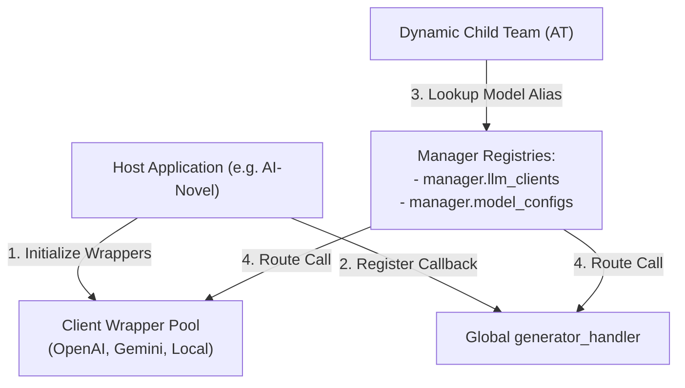

# ATT (AI-Team-Team) Framework Evolution Roadmap

This document outlines the design blueprints, architectural optimizations, and next-generation evolution paths for the **AI-Team-Team (ATT)** multi-agent orchestration framework.

## 🎯 Overview

The next iterations of the ATT framework focus on:

1. **Heterogeneous Model Routing**: Enabling agents to map specific roles to different LLM providers based on complexity.
2. **Concurrency & RT Reduction**: Resolving synchronous ReAct blocking bottlenecks using async execution.
3. **Robustness & Security Gating**: Hardening parser resilience, isolating exceptions, and enforcing organizational migration limits.

## 1. Heterogeneous LLM Provider Registry

### Objective

Allow dynamic agent teams to map different members to different LLM providers (e.g., Google GenAI, OpenAI, Anthropic, or local endpoints) depending on task complexity and budget constraints.

### Design Paradigm

The framework remains completely agnostic of model connections, API keys, and HTTP transports (Dependency Injection). Instead, it maps model aliases to client wrappers registered by the host application.



### Implementation Plan

* **Explicit Client Registry (`manager.llm_clients`)**:
  * Let host applications register pre-instantiated wrappers conforming to `LLMClientProto` (implementing `generate(...)`).
  * Example: `manager.llm_clients["Gemini"] = OpenAIClient(...)`.
* **Unified Callback Registry (`manager.register_generator_handler`)**:
  * Expose a single global handler for routing requests based on model aliases.
  * Example: `def handler(model_name, prompt, system_instruction, require_json, temperature)`.
* **Spawning Resolution**:
  * Verify role-to-model mapping in `ATTConfig.model_registry` and bind the correct client to the `Agent` instance during `create_agent_team(...)` and `dispatch_subagent(...)`.

## 2. Core Architectural Optimizations

### 2.1 Async/Await ReAct Loops (Concurrency)

* **Problem**: Currently, the discussion loop inside `execute_team_discussion` and `execute_react_step` is entirely synchronous and single-threaded. In multi-agent panels, this leads to $N \times R \times S$ (Members $\times$ Rounds $\times$ Steps) sequential blocking LLM requests, causing latency overheads of several minutes.
* **Solution**:
  * Transition all execution chains (`execute_team_discussion`, `execute_react_step`, and `generate` adapters) to native Python `asyncio` (`async def` and `await`).
  * Introduce parallel execution blocks where independent agents (such as initial analysts or validation nodes) run their ReAct loops concurrently, significantly reducing response times.

### 2.2 Robust ReAct Action Parser

* **Problem**: The parser relies on the regex `Action:\s*(\w+)\((.*)\)`. High temperature configurations or smaller open-source models often output actions enclosed in Markdown tags (e.g. `Action: ```python query_db(...) ``` `) or formatting containing newlines, causing parser failures and agent loops.
* **Solution**:
  * Pre-process LLM outputs to strip Markdown code block fences (e.g., ` ```python ` / ` ``` `) before regex evaluation.
  * Compile regex with `re.DOTALL` to support multiline argument blocks.
  * Provide an alternative XML-based structured parser (e.g. `<action name="query_db">...</action>`), which models follow with high compliance.

### 2.3 Organizational Restructuring Migration Gates

* **Problem**: `ATTConfig` declares `max_migrations_per_team_discussion = 1`, and `AgentTeam` tracks `migration_count`, but `ATTManager.negotiate_and_execute_migration` fails to validate or increment this counter. Unstable agents could cause endless reorganizational loops.
* **Solution**:
  * Add validation check at the beginning of `negotiate_and_execute_migration`:

  ```python
  if team.migration_count >= self.config.max_migrations_per_team_discussion:
      return False, "Rejected: Migration limit exceeded for this discussion session."
  ```

  * Increment `team.migration_count += 1` immediately upon successful migration arbitration.

### 2.4 Clean Exception Isolation

* **Problem**: If an LLM client throws an API rate-limit error or network exception during a ReAct loop, it is caught and returned as a string `"Error executing task: {e}"`. This error text is treated as a normal `Final Answer` and appended to the dialog history, causing downstream agents to hallucinate or misinterpret system failures as business logic conclusions.
* **Solution**:
  * Implement an internal retry policy (e.g. up to 3 retries with exponential backoff) for transient API network failures.
  * If retries fail, propagate the exception to halt the loop safely or escalate the failure as a structured system anomaly to the Supervisory Team, preventing it from polluting the discussion transcript.

## 3. Next-Gen Evolution Path

### 3.1 Standard Lexical Argument Parsing

* **Blue-sky Concept**: Replace the fragile `split(",")` fallback when `ast.literal_eval` fails to evaluate arguments.
* **Design**:
  * Utilize Python's standard `shlex` (shell lexical analyzer) module or a custom parser to extract arguments.
  * Ensure parameters containing commas (such as SQL strings `SELECT name, age FROM characters` or text queries) are parsed as a single argument instead of being split incorrectly.

### 3.2 Active Permission Gates in Tool Execution

* **Blue-sky Concept**: Ensure agents operate strictly within the communication bounds defined by their parent teams.
* **Design**:
  * Integrate a pre-execution verification hook in the Tool runner.
  * When an agent calls `send_peer_message` or `dispatch_subagent`, the executor calls `NegotiationBroker.negotiate_communication` beforehand.
  * If unauthorized, instead of raising an error, return a structured observation: `Observation: Error: Permission Denied. Sibling talk is not authorized. You must call set_sibling_talk to request access.` This trains agents to adapt dynamically to permission boundaries.
