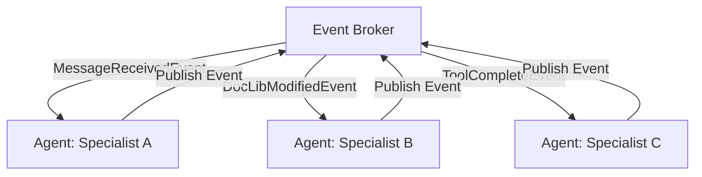

# Architectural Design: Asynchronous & Event-Driven Agent Collaboration

> [!TIP]
> This is just a conceptual idea, and the idea itself is not fully thought out.

This document proposes the transition of the **AI-Team-Team (ATT)** framework from a synchronous, turn-based (round-robin) discussion model to a fully asynchronous, event-driven reactive collaboration model.

## 1. Limitations of the Current Turn-Based Model

The current implementation of `execute_team_discussion` relies on a synchronous round-by-round mechanism:

1. **High Latency**: The discussion round waits for all participating agents to sequentially finish their reasoning steps (turn-by-turn). The total duration is the sum of each agent's execution latency.
2. **Passive Reaction**: Agents cannot react proactively to external events (such as document changes in `DocLib`, background tool completions, or subteam failures) until their specific turn is called by the coordinator.
3. **Context Pollution**: Due to sequential turn-taking, agents are forced to process all intermediate dialogues in bulk, even when many turns are irrelevant to their specific role.
4. **No Long-Running Background Execution**: Agents cannot initiate a long-running task (e.g., compiling a binary or running an external test suite) and yield execution. They must block the turn or finish prematurely.

## 2. Proposed Event-Driven Architecture

Instead of running a fixed-turn loop, each `Agent` is modeled as an independent **async actor** running a persistent event-loop, communicating via a message-driven publish-subscribe pattern.



### Key Components

#### 1. Central Event Broker (`EventBroker`)

Each `AgentTeam` maintains an `EventBroker` to dispatch event payloads asynchronously:

* `MessageReceivedEvent`: Broadcast of a public message or delivery of a direct private message to an agent's inbox.
* `DocLibModifiedEvent`: Fired whenever a document is added, edited, or deleted in the team's shared library.
* `ToolCompleteEvent`: Fired when an asynchronous background tool (e.g. compiling, testing) finishes execution.
* `SupervisorSignalEvent`: Fired by the auditing committee to trigger pause, resume, or emergency restructuring.

#### 2. Subscription Filters & Reactive Activation

Instead of passive execution, agents register interest in specific event filters. For example:

* An *Integrity Officer* agent subscribes to `DocLibModifiedEvent` for paths matching `src/**/*.py`.
* A *QA Specialist* agent subscribes to `ToolCompleteEvent` for task ID `task-test-suite`.
* When a matching event is published, the agent is activated, its context is compiled, and a reasoning step is scheduled on the event loop.

#### 3. Free & Organic Dialogue (Non-Sequential Discussion)

Rather than forcing agents to speak in a strict round-robin order, agents engage in a free-flowing, organic group-chat style conversation:

* **Contextual Chime-In**: Agents decide when to speak based on their individual role mission, the current state of the conversation, and whether they have something relevant, corrective, or supplementary to add. They listen to the active dialogue and organically choose whether to respond, stay silent, or wait for others.
* **Concurrency & Self-Interruption**: Multiple agents can formulate thoughts concurrently as messages flow in. If an agent is mid-thought and reads a newly posted message that contradicts, corrects, or renders their draft redundant, they naturally interrupt their own reasoning, assimilate the new information, and adjust or discard their response, just like humans typing in a live chat.
* **Conversational Pacing & Dynamic Turn-Taking**: Instead of artificial locks or token-bucket systems, agents self-organize the conversation flow. They space their replies based on conversational pacing, pause breaks, direct @mentions, and context relevance, allowing the dialogue to converge naturally through organic social cues rather than rigid mechanical constraints.

#### 4. Execution Suspension & Preemption

* **Awaiting / Yielding**: When an agent triggers a long-running tool, it returns a special instruction `<suspend task_id="X"/>`. The agent's loop enters a `SUSPENDED` state, yielding event-loop CPU cycles.
* **Preemption by Priority**: Messages are classified by priority (`Low`, `High`, `Critical`). A `Critical` event (e.g. parent emergency wakeup or subagent team failure) immediately interrupts an agent's current low-priority reasoning step. The agent's current context is preempted with an interrupt frame, forcing it to immediately address the emergency.

## 3. Implementation Design

### Reactive Agent Loop (`ReactiveReasoningStrategy`)

The proposed execution loop inside `strategies.py` will run a message processing loop:

```python
class ReactiveReasoningStrategy(BaseReasoningStrategy):
    async def execute(self, team, agent, manager):
        while agent.status == "Active":
            # Wait for an event to arrive in the agent's private queue
            event = await agent.event_queue.get()
            
            if event.priority == "Critical" and agent.is_thinking:
                # Handle preemption/interrupt
                await self._handle_interrupt(agent, event)
            else:
                # Process the event in the reasoning context
                await self._process_event(agent, event, team, manager)
```

### Database & State Modeling

To persist suspended agents across runtime restarts, the SQLAlchemy schemas in `models.py` will be updated:

* **`AgentState` Table**: Tracks the execution status (`IDLE`, `THINKING`, `SUSPENDED`, `HIBERNATED`).
* **`EventQueue` Table**: Serializes queued events waiting to be processed by each agent.
* **`TaskPromise` Table**: Maps task IDs of long-running async tools to the agent awaiting their completion.

## 4. Discussion Evolution & Convergence Gating

Without fixed rounds, how does a team discussion converge?

* **Consensus Gating**: The discussion remains active as long as there are events in the queue.
* **Inactivity Timeout**: If the team's event queue is empty for a configured cooldown period (e.g., 5 seconds), the team enters an `IDLE` state.
* **Supervisor Resolution**: The `SupervisorTeam` periodically audits the active event frequency. If it detects infinite chatter (livelock), it broadcasts a `SupervisorSignalEvent` to terminate the discussion or force a leader to synthesize the final answer.
