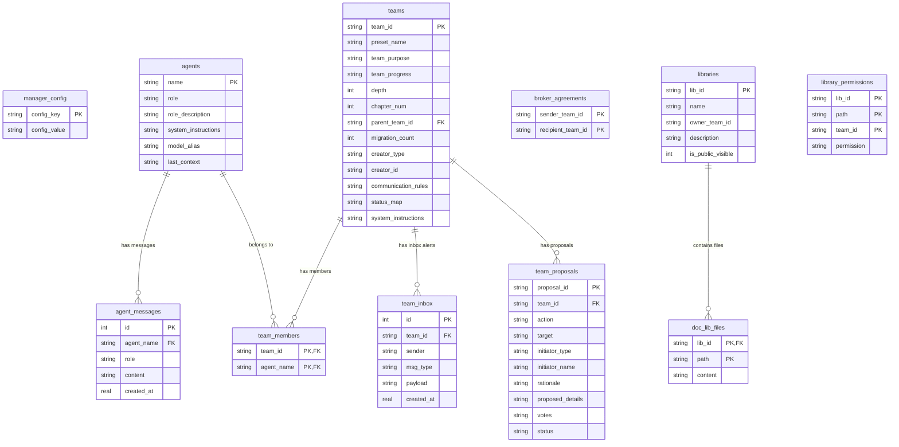

# State Persistence & Multi-Turn Memory Architecture

This document describes the SQLite-backed state snapshotting, workflow recovery, and true multi-turn agent memory architecture implemented in the ATT (AI-Team-Team) framework.

---

## 1. Architectural Overview

Instead of stateless executions or pseudo-memory constructed via transient string concatenation, the ATT framework uses:

1. **Multi-Turn Agent Memory**: Structured message threads (`List[Dict[str, str]]`) stored inside each `Agent` instance, compatible with Chat APIs.
2. **Context-Switching Notices**: Diagnostic warning logs injected automatically when a shared agent transitions between teams/roles/tools.
3. **SQLite State Snapshotting**: A single self-contained local SQLite database file that serializes the entire active manager topology, lineage nodes, inbox metrics, debate proposals, and document libraries.

### Topology Schema (ER Diagram)

The SQLite database mirrors the dynamic parent-child topology, agent properties, libraries, and inbox states:

---

## 2. SQLite Database Schema Tables

### `manager_config`

Stores top-level ATT Manager settings (e.g. `att_config` serialized as JSON) and references like `root_ai_name`.

### `agents` & `agent_messages`

Stores the core identities and multi-turn message histories of all agents. `model_alias` records their execution client fallback targets. `agent_messages` maintains sequential order using `created_at` timestamps.

### `teams` & `team_members`

Stores the active team topologies, purposes, progress metrics, sibling communication policies, and memberships. Reconstructs complex parent-child lineage pointers via `parent_team_id`.

### `team_inbox` & `team_proposals`

Stores unresolved alerts escalated from child teams and active votes. Votes and proposal payloads are stored as JSON arrays.

### `broker_agreements`

Stores tunnels negotiated dynamically by the `NegotiationBroker` to authorize cross-lineage peer-to-peer dialogues.

### `libraries`, `library_permissions` & `doc_lib_files`

Stores file permissions ACLs and full file paths and content strings.

## 3. Serialization Lifecycle

### Auto-Saving

The system automatically captures snapshots by invoking `manager._auto_save()` on critical state modifications:

* Spawning teams (`create_agent_team`)
* Adding/removing members (`add_team_member`, `remove_team_member`)
* Creating/negotiating voting proposals (`cast_vote`, `initiate_membership_vote`, etc.)
* Reaching debate conclusions (`execute_team_discussion`)
* Executing tools during ReAct loops (`execute_react_step`)
* Direct writing/deleting file modifications inside libraries (`write_library_file`, `delete_library_file`)

### Recovery Workflow (`load_state`)

1. **Config Restoration**: Restores parameters and binds `self.root_ai`.
2. **Agent Cache Rebuilding**: Recreates `Agent` instances, restores their `llm_client` adapter, and re-sequences their multi-turn `messages`.
3. **Physical File Restoration**: Iterates through `doc_lib_files`, clears local `.att_doc_libs/<lib_id>` folders, and writes files back to disk.
4. **Topology Lineage Reconstruction**: Two-pass deserialization of the lineage hierarchy:
   * First pass: Instantiates teams, sets parameters, status maps, and sibling permissions.
   * Second pass: Hooks up dual-linked node references (`parent_team` and `child_teams`) and restores their `creator` object pointers.
5. **Tool & Library Binding**: Binds permissions, restores member arrays, links built-in libraries, and registers system tools.
6. **Agreements & Inboxes**: Hydrates active proposals, unresolved inboxes, and negotiated broker agreements.
