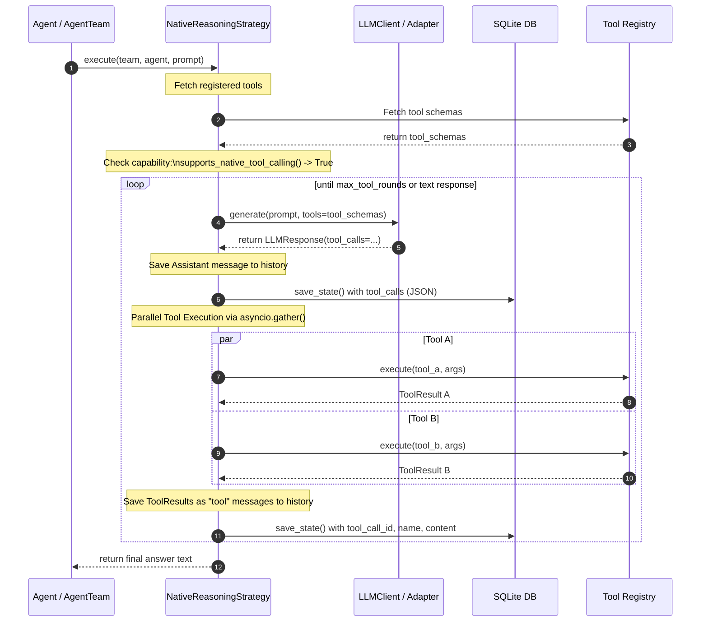

# Dual-Mode Tool Calling & Reasoning Strategies Architecture

This document describes the design, implementation, and sequence flows of the **Dual-Mode Tool Calling & pluggable Reasoning Strategies** architecture implemented in the ATT (AI-Team-Team) framework.

## 1. Architectural Overview

To make reasoning execution vendor-independent and model-agnostic, the ATT framework decouples the reasoning loop from individual LLM clients. It implements a Strategy Pattern to govern how agent turns are executed.

```plaintext
                   ┌──────────────────────────┐
                   │    Agent / AgentTeam     │
                   └────────────┬─────────────┘
                                │ Calls execute_reasoning_step()
                                ▼
                   ┌──────────────────────────┐
                   │   Reasoning Strategy     │
                   │    Selection Route       │
                   └──────┬────────────┬──────┘
                          │            │
          If Native Mode  │            │ If Text ReAct Mode
          or Auto capable │            │ or Auto fallback
                          ▼            ▼
             ┌────────────────┐    ┌────────────────┐
             │ Native Strategy│    │ ReAct Strategy │
             │   (Parallel)   │    │  (Sequential)  │
             └────────────────┘    └────────────────┘
```

The system supports two core execution modes:

1. **Text ReAct Mode (`"text_react"`)**: A classic step-by-step loop alternating between Thought, Action (parsed via regex), and Observation.
2. **Native Tool Calling Mode (`"native"`)**: Executes structured tool invocations directly using LLM function calling schemas, running multiple tool calls concurrently in parallel.

## 2. Pluggable Reasoning Strategies

Reasoning strategies are encapsulated as pluggable classes inheriting from `BaseReasoningStrategy`.

### Class Hierarchy

* **`BaseReasoningStrategy`**: Abstract class declaring the `execute(...)` interface.
* **`TextReactReasoningStrategy`**: Implements the XML-tag and regex-parsed ReAct execution loop.
* **`NativeReasoningStrategy`**: Implements native tool-calling loop:
  1. Requests structured tool JSON schemas from the registry.
  2. Submits prompt messages and schemas to the LLM client adapter.
  3. Receives structured `tool_calls` inside the unified `LLMResponse`.
  4. Spawns parallel executions for all `tool_calls` concurrently.
  5. Feeds `ToolResult` messages back to the history buffer and repeats.

### Strategy Auto-Routing

During execution, if the `tool_calling_mode` in `ATTConfig` is set to `"auto"`, the team queries the agent's LLM client:

```python
if hasattr(agent.llm_client, "supports_native_tool_calling") and agent.llm_client.supports_native_tool_calling():
    strategy = NativeReasoningStrategy()
else:
    strategy = TextReactReasoningStrategy()
```

This capability check ensures that capable models (e.g. GPT-4, Gemini Pro) automatically use fast, parallel native tool calling, while older or smaller local models fallback gracefully to text-based ReAct.

## 3. Automated Schema Generation

The framework features a robust `Schema Resolver` that automatically converts various pythonic types into standard JSON tool schemas. When registering a tool, you can pass:

1. **Handwritten Schema**: A standard python dictionary containing raw JSON Schema properties.
2. **Pydantic Model**: A `BaseModel` subclass. The resolver calls `.model_json_schema()` (or `.schema()` on older versions) to extract properties and descriptions.
3. **TypedDict Class**: A standard python `TypedDict`. The resolver inspects type annotations using `typing.get_type_hints()` to build fields and identifies required parameters based on the dictionary's total configuration.
4. **Function Signatures**: If no schema is provided, the resolver reflects the python function's signature and parses parameter defaults, parameter type annotations, and the docstring first line to construct the JSON schema dynamically.

## 4. Concurrent Parallel Tool Execution

Unlike the sequential execution loop of the text ReAct mode, the native strategy runs independent tool requests **concurrently in parallel** to minimize network latency and improve agent response speeds.

When the LLM returns multiple `tool_calls` (e.g. fetching weather for multiple cities, or running multiple SQL queries), the Native Strategy runs them concurrently:

```python
# Concurrently gather all tool executions in parallel
results = await asyncio.gather(*[
    run_tool(call.name, call.arguments) for call in response.tool_calls
])
```

Each execution output is converted into a structured `ToolResult` and serialized into the agent's message queue.

## 5. Sequence Diagram

This sequence diagram illustrates the runtime workflow of a native reasoning step, detailing capability checking, parallel execution, and database state persistence:



## 6. Persistence & Serialization

To support 100% state recovery after crashes, the SQLite database schema has been updated. The `AgentMessageModel` table contains three columns mapping to the structured tool calls:

* **`tool_calls`**: A native SQLite `JSON` column storing the list of structured tool executions.
* **`tool_call_id`**: A string column mapping the message to its specific trigger call ID (required when role is `"tool"`).
* **`name`**: A string column specifying which tool was executed (required when role is `"tool"`).

These columns are serialized in `save_state` and reconstructed fully in `load_state`, preserving the complete multi-turn reasoning context.
