# Autonomous Communication Governance

This document maps the complete lifecycle of ATT communication authority, channel approval, durable delivery, recovery, and revocation.

`ATTConfig` defines the communication institution for every AgentTeam at every topology depth.

An Agent performs the tool invocation, but all communication authority comes from its invocation-scoped AgentTeam.

## 1. Authority Boundary and Public Operations

Communication tools resolve both the active Agent and active AgentTeam from invocation `ContextVar` state.

The Agent must be active, registered, and a current member of that AgentTeam.

The tools do not accept sender, policy, direction, mode, or approval-principal overrides.

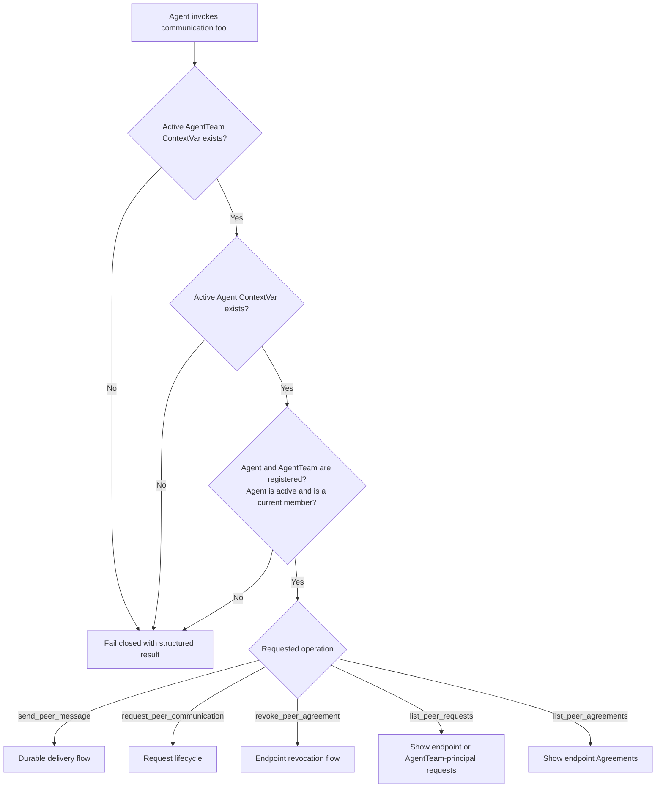

The Root AI is an `agent` governance principal and is never a communication endpoint.

| Operation | Structured statuses |
| --- | --- |
| `send_peer_message` | `DELIVERED`, `NO_AGREEMENT` |
| `request_peer_communication` | `APPROVED`, `PENDING_APPROVAL`, `DENIED`, `ALREADY_ACTIVE` |
| `revoke_peer_agreement` | `REVOKED`, `ALREADY_REVOKED`, `FORBIDDEN` |

## 2. Communication Institution Selection

The policy is read from `ATTConfig.communication` and is copied into each governed request as an immutable policy snapshot.

`CommunicationConfig` is a strict Pydantic discriminated union with forbidden extra fields and runtime assignment validation.

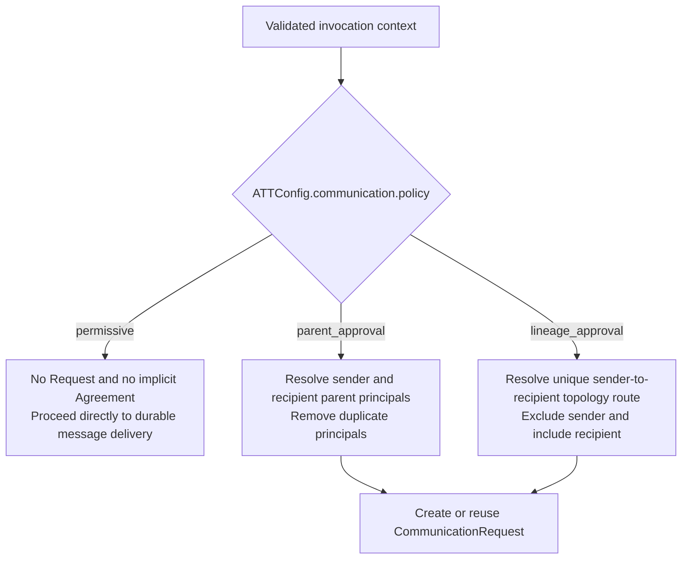

Approval configurations also define `request_delivery` as `queue` or `wake` and `direction` as `one_way` or `bidirectional`.

Changing `ATTConfig.communication` later does not modify an existing request snapshot or revoke an active Agreement.

Approval institutions create persistent channels only and do not provide a single-message approval mode.

## 3. Approval Principal Path Algorithms

Every approval authority is an immutable `ApprovalPrincipal(kind="agent_team" | "agent", principal_id=...)`.

### Parent Approval

An ordinary AgentTeam parent becomes an `agent_team` principal.

A top-level AgentTeam has the Root AI Agent as its parent principal.

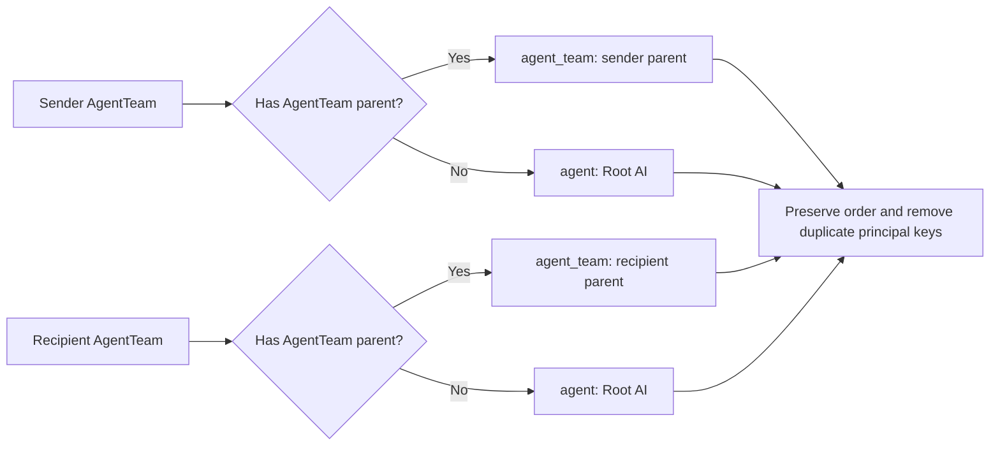

### Lineage Approval

The sender's act of requesting the channel is the sender AgentTeam's consent, so the sender is excluded from the approval path.

The recipient and every intermediate AgentTeam on the unique route are included.

The Root AI Agent is included only when the route crosses separate top-level branches.

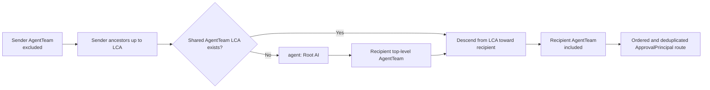

## 4. CommunicationRequest Creation and Deduplication

`request_peer_communication()` never sends a message and never creates a request under the permissive institution.

Under an approval institution, the request operation first checks for an already sufficient Agreement and then checks for an equivalent pending request.

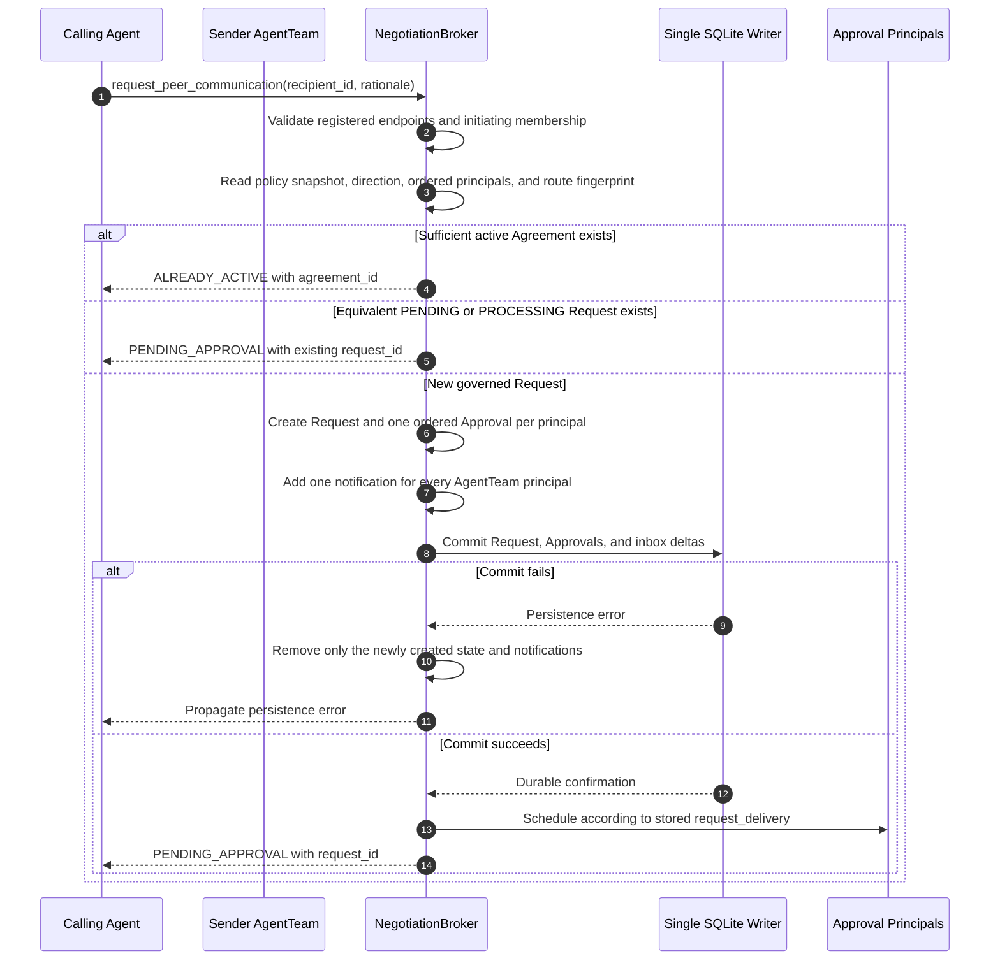

Equivalent pending requests are matched by endpoints, direction, and policy snapshot.

A denied request does not prevent a later request with a new request ID and rationale.

## 5. Queue and Wake Delivery

AgentTeam and Agent principals use different scheduling because only AgentTeams have discussion inboxes.

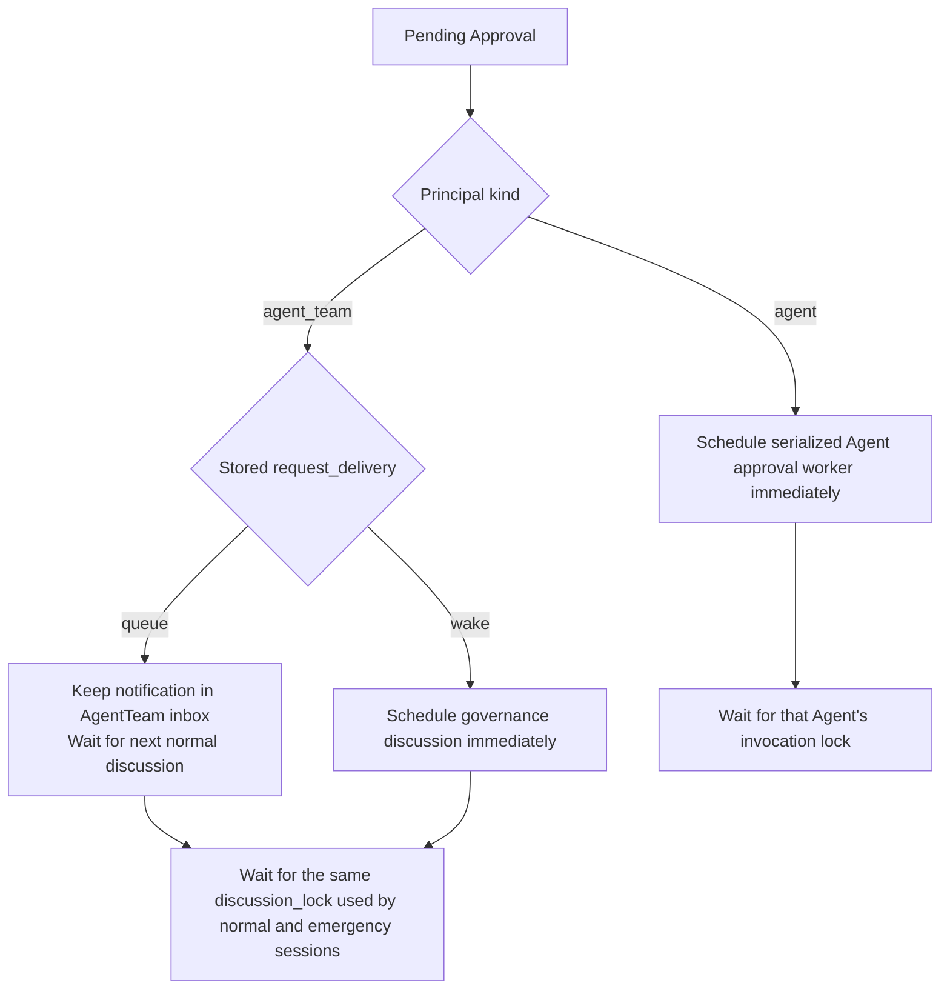

Scheduling is deduplicated by `request_id + principal`.

Approval tasks are never awaited inside the initiating communication tool stack.

Different AgentTeams may process approvals concurrently, while the same AgentTeam remains serialized.

## 6. AgentTeam Governance Decision

The active member set is frozen only after the AgentTeam discussion lock has been acquired.

The governance discussion must reach its successful session boundary before ballots may begin.

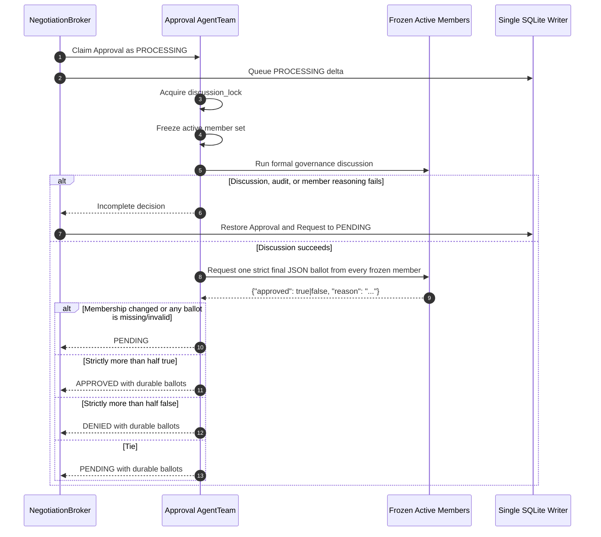

Strings, numbers, null, missing fields, and extra fields are invalid ballots.

Every frozen member must produce a valid ballot before a majority can become authoritative.

## 7. Agent Governance Decision

An Agent principal may decide only for its own explicitly listed authority.

No other Agent can substitute for an unavailable Agent principal.

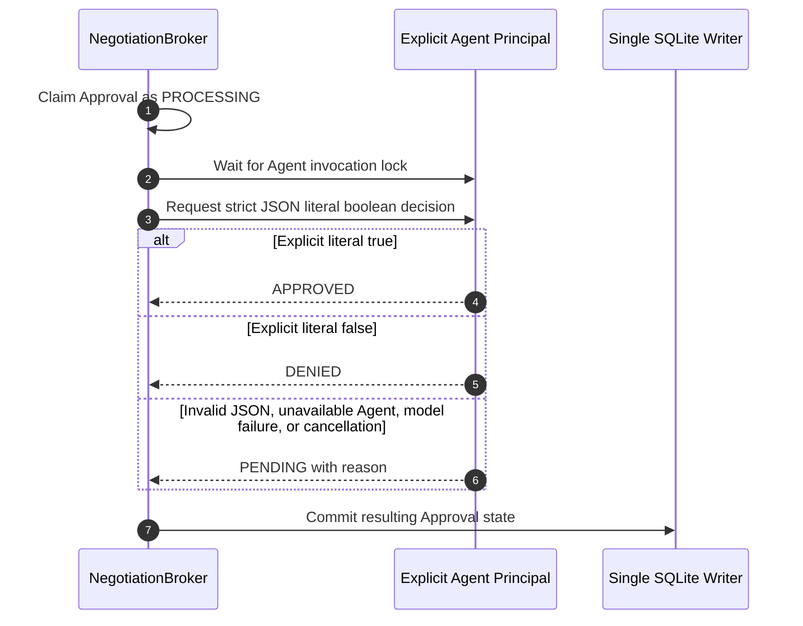

Root AI approvals use this exact Agent path without a special Root principal type.

## 8. Approval Completion, Denial, and STALE Successors

Approval completion mutates communication state under the manager-level communication transaction lock without holding that lock during LLM work.

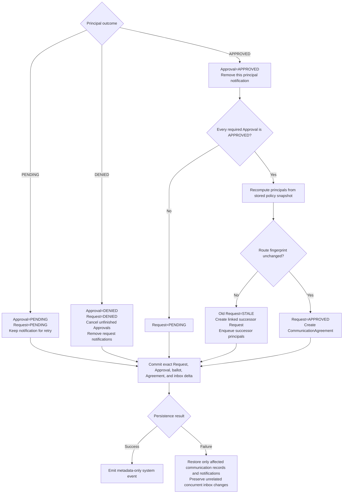

A relevant topology change produces a linked successor instead of applying an authorization from the old route.

An unrelated topology change does not alter the route fingerprint and does not invalidate the request.

## 9. CommunicationAgreement Direction and Supersession

An approved request creates exactly one persistent Agreement.

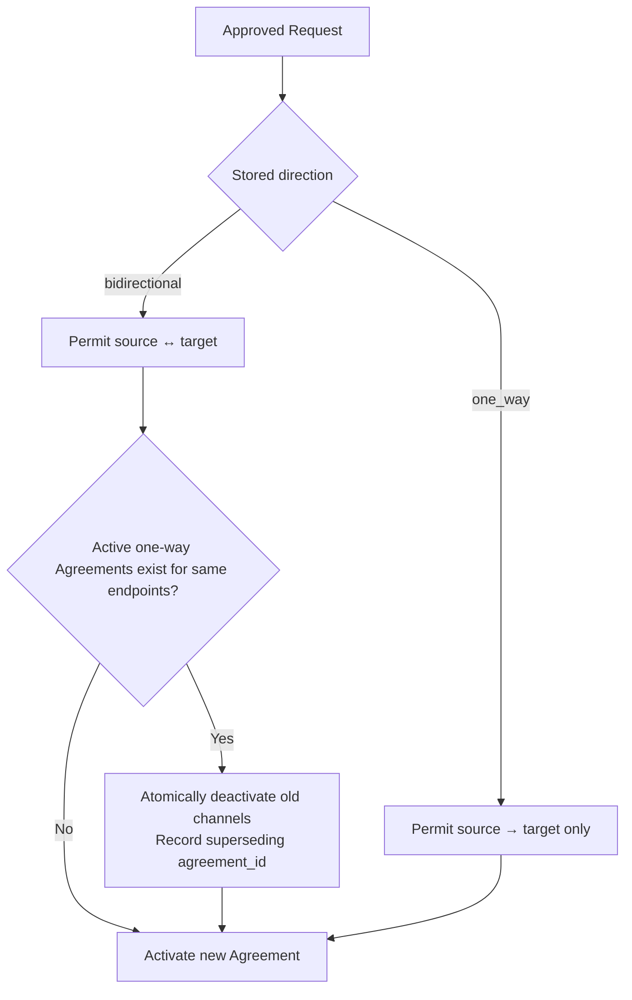

An active bidirectional Agreement satisfies later requests in either endpoint order.

Opposite one-way Agreements may coexist until a bidirectional Agreement supersedes them.

Agreements remain active until an endpoint revokes them explicitly.

## 10. Durable Peer Message Delivery and Consumption

`send_peer_message()` performs delivery only and never creates a Request automatically.

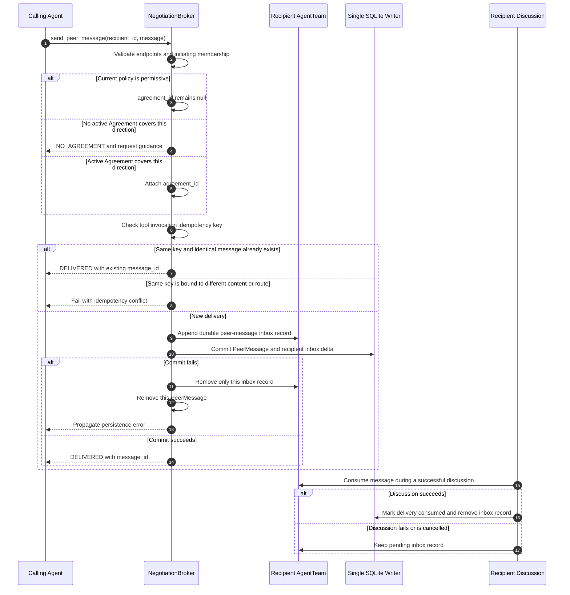

Callbacks and system events contain IDs, endpoints, paths, operation types, and results without logging peer-message content.

## 11. Endpoint Revocation

Only the source or target AgentTeam may revoke an Agreement.

Approval principals and unrelated AgentTeams cannot revoke the channel.

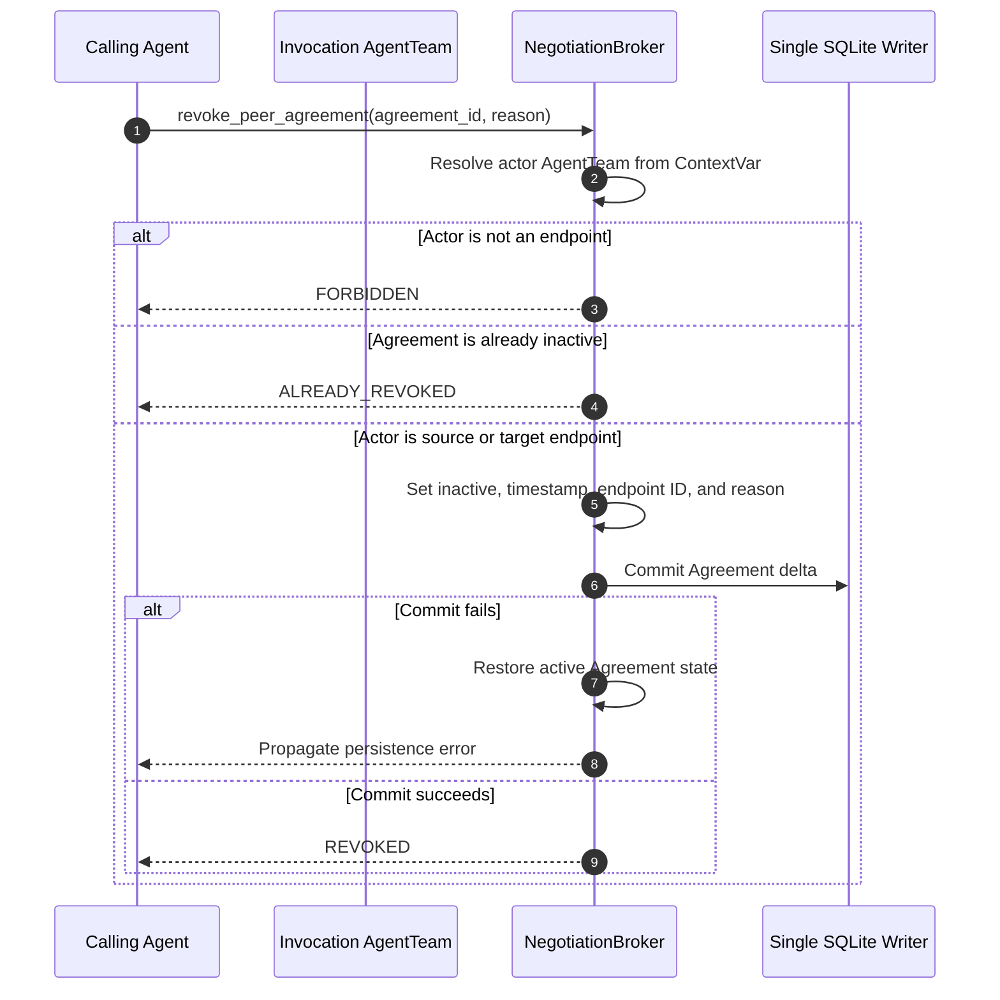

Revocation does not delete historical requests, approvals, ballots, Agreements, or delivery records.

## 12. Persistence, Restore, and Shutdown

Schema 6 stores requests, ordered approvals, ballots, Agreements, peer deliveries, and correlated AgentTeam inbox records.

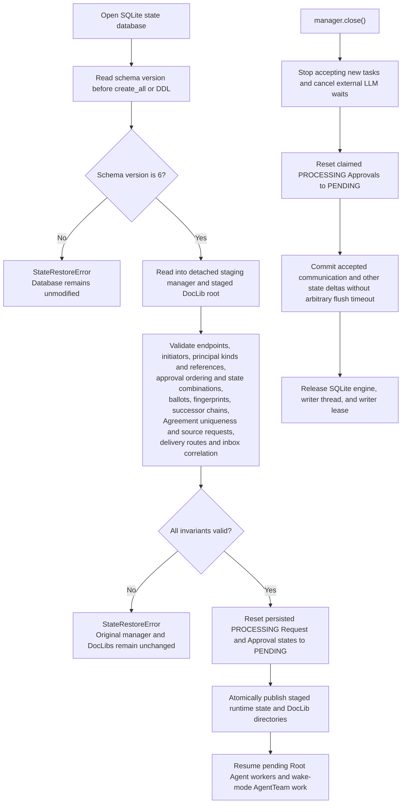

Restore rejects missing endpoints, missing initiating Agents, unauthorized Agent principals, malformed status combinations, duplicate routes, broken successor chains, invalid Agreement sources, and orphaned peer-delivery notifications.

Each SQLite database permits only one active writer manager through a cross-process writer lease.

The persistence coordinator keeps at most one active delta and one coalesced pending delta.

## 13. Isolation Invariants

* Communication Agreements never grant DocLib ACL, public-discovery, managed-link, or file permissions.
* A communication AgentTeam cannot use an Agent's Private DocLib unless that Agent explicitly invokes a private tool as its owner.
* Communication rationale and peer-message content do not become authority credentials.
* Root AI governance authority does not make Root AI a peer-message endpoint.
* AgentTeam authority is recorded as the AgentTeam even though individual Agents provide ballots and tool invocations.
* Member order, creator identity, role labels, and model availability never create implicit communication authority.
