# SQLite Database Schema Entity-Relationship (ER) Diagram

This document provides the visual Entity-Relationship (ER) diagram mapping all SQLAlchemy ORM database models, data types, primary/foreign keys, and relational cardinality in the SQLite state snapshotting engine.

## 1. Complete Database ER Diagram

The following Mermaid diagram maps out the relational schema of the persistence database:

```mermaid
erDiagram
    manager_config {
        string config_key PK "Primary Key (e.g., 'att_config', 'root_ai_name')"
        string config_value "Serialized configuration value (JSON or string)"
    }
    
    agents {
        string name PK "Primary Key (Agent name, e.g., 'Dynamic_Planner')"
        string role "Assigned role name"
        string role_description "Description of role responsibilities"
        string system_instructions "Agent's individual system prompt instructions"
        string model_alias "Target model config alias"
        string last_context "Last executed context state (JSON)"
    }
    
    agent_messages {
        int id PK "Auto-incrementing Primary Key"
        string agent_name FK "Foreign Key referencing agents.name"
        string role "Message role ('user', 'assistant', 'system')"
        string content "Raw message content string"
        real created_at "Timestamp of message creation"
    }
    
    teams {
        string team_id PK "Primary Key (Format: 'AT-xxxxxx')"
        string preset_name "Dynamic preset name (e.g., 'analysts', 'generic')"
        string team_purpose "Globally broadcasted purpose statement"
        string team_progress "Broadcasted progress metric statement"
        int depth "Hierarchy level depth integer"
        int chapter_num "Current log chapter index"
        string parent_team_id FK "Foreign Key referencing teams.team_id (self-referential parent)"
        int migration_count "Count of migrations executed"
        string creator_type "Creator node type ('agent' or 'team')"
        string creator_id "Name/ID of creator node"
        string communication_rules "Inbox gating policies (JSON)"
        string status_map "Status metrics of members (JSON)"
        string system_instructions "Dynamic team system instruction prompt"
    }
    
    team_members {
        string team_id PK, FK "Composite PK, FK referencing teams.team_id"
        string agent_name PK, FK "Composite PK, FK referencing agents.name"
    }
    
    team_inbox {
        int id PK "Auto-incrementing Primary Key"
        string team_id FK "Foreign Key referencing teams.team_id"
        string sender "Sender node name/ID"
        string msg_type "Message type ('escalation_spawn', 'peer_message')"
        string payload "Raw alert content or payload (JSON)"
        real created_at "Timestamp of message entry"
    }
    
    team_proposals {
        string proposal_id PK "Primary Key (Format: 'VP-xxxxxx')"
        string team_id FK "Foreign Key referencing teams.team_id"
        string action "Proposal action ('add' or 'remove')"
        string target "Name of role/member target"
        string initiator_type "Initiator node type ('individual')"
        string initiator_name "Name of initiator agent"
        string rationale "Reasoning submitted for voting"
        string proposed_details "Configurations for additions (JSON)"
        string votes "Submitted ballots and rationales (JSON)"
        string status "Current status ('active', 'approved', 'rejected')"
    }
    
    broker_agreements {
        string sender_team_id PK "Composite PK referencing teams.team_id"
        string recipient_team_id PK "Composite PK referencing teams.team_id"
    }
    
    libraries {
        string lib_id PK "Primary Key (Format: matches team_id)"
        string name "DocLib folder name"
        string owner_team_id "Owner team reference ID"
        string description "Library description metadata"
        int is_public_visible "Boolean visibility flag (0 or 1)"
    }
    
    library_permissions {
        string lib_id PK "Composite Primary Key"
        string path PK "Composite Primary Key (Target folder/file prefix path)"
        string team_id PK "Composite Primary Key referencing teams.team_id"
        string permission "Granted permission level ('READ' or 'WRITE')"
    }
    
    doc_lib_files {
        string lib_id PK, FK "Composite PK, FK referencing libraries.lib_id"
        string path PK "Composite Primary Key (Absolute virtual file path)"
        string content "Raw file content blob or string"
    }

    %% Relationships
    agents ||--o{ agent_messages : "owns messages"
    teams ||--o{ team_members : "contains members"
    agents ||--o{ team_members : "belongs to"
    teams ||--o{ team_inbox : "contains inbox alerts"
    teams ||--o{ team_proposals : "contains proposals"
    libraries ||--o{ doc_lib_files : "contains files"
```

