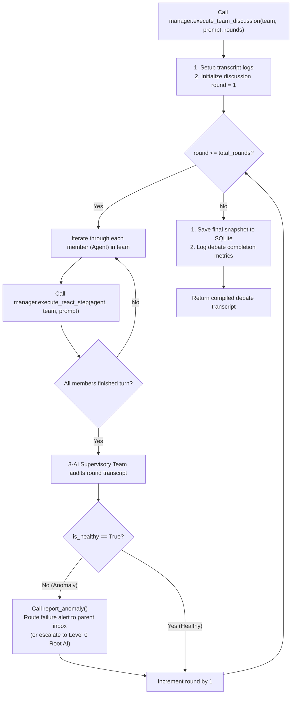
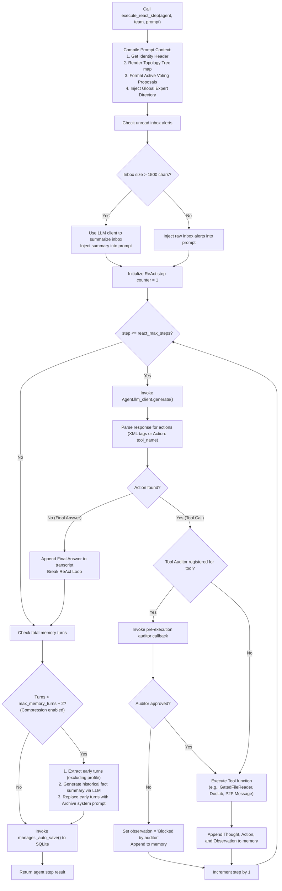

# Unified Multi-Agent Discussion & ReAct Execution Loop

This document provides visual flowcharts mapping the core runtime execution engine of the ATT framework.

## 1. Master Discussion Loop (`execute_team_discussion`)

This flowchart sequences the multi-round cooperative debate process executed when a team is tasked with resolving a prompt:

## 2. Granular Agent Turn & ReAct Step (`execute_react_step`)

This flowchart outlines the prompt compilation, ReAct reasoning loop, tool execution auditing, memory compression, and auto-saving performed during a single agent's execution turn:

