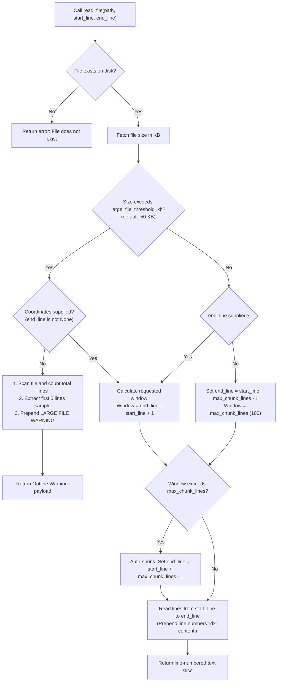
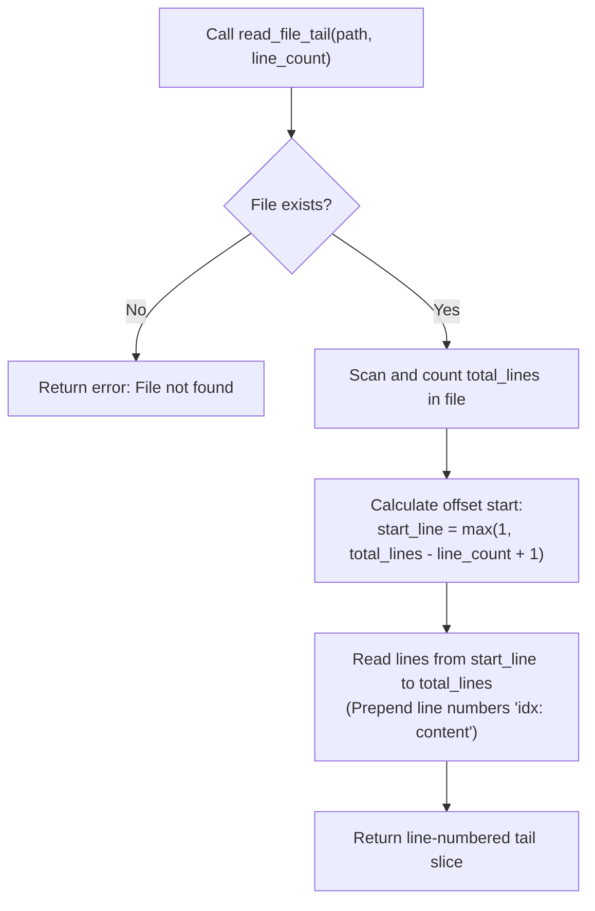
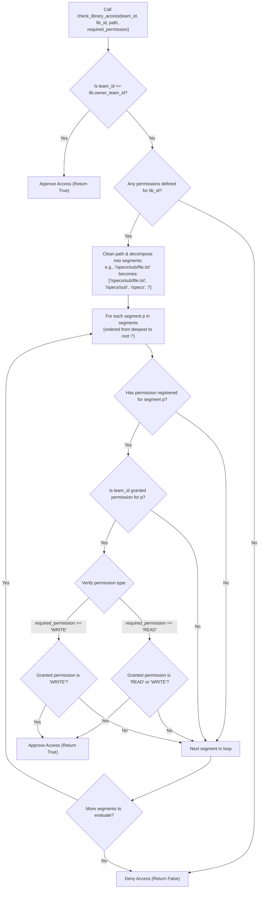

# Gated Paginator Reading Flowchart

This document visualizes the control flow and slice boundaries enforced by the size-aware `GatedFileReader`.

## 1. Gated Read File Decision Flowchart

This flowchart outlines the logic executed when an agent node calls the `read_file(path, start_line, end_line)` tool:

## 2. Streaming Tail Read Decision Flowchart

This flowchart visualizes the log tailing helper `read_file_tail(path, line_count)`:

## 3. DocLib ACL Segment-Based Path Permission Resolution Flowchart

This flowchart details the segment-based folder/file path traversal logic executed during `check_library_access` to evaluate read/write permissions:

Managed cross-library file links add a second resolution phase after source authorization. ATT follows `lib_id + relative path` metadata, repeats the same ACL check at every hop for the requested permission, rejects cycles, and opens only the final physical file. No operating-system symlink is followed.
