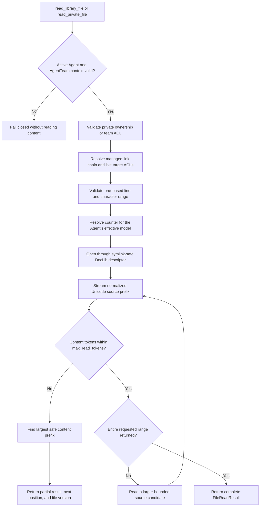
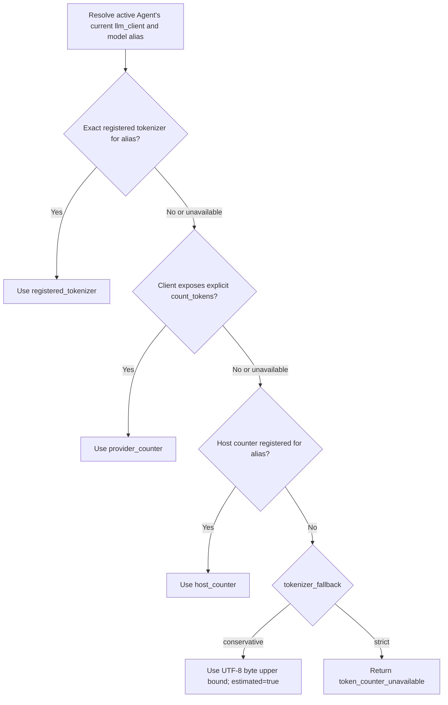
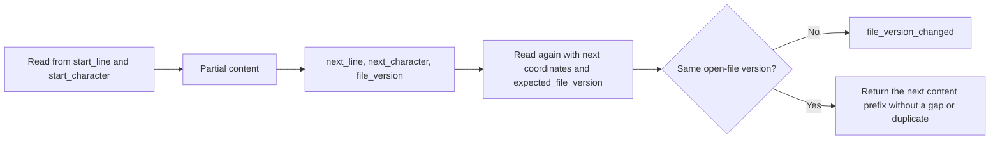
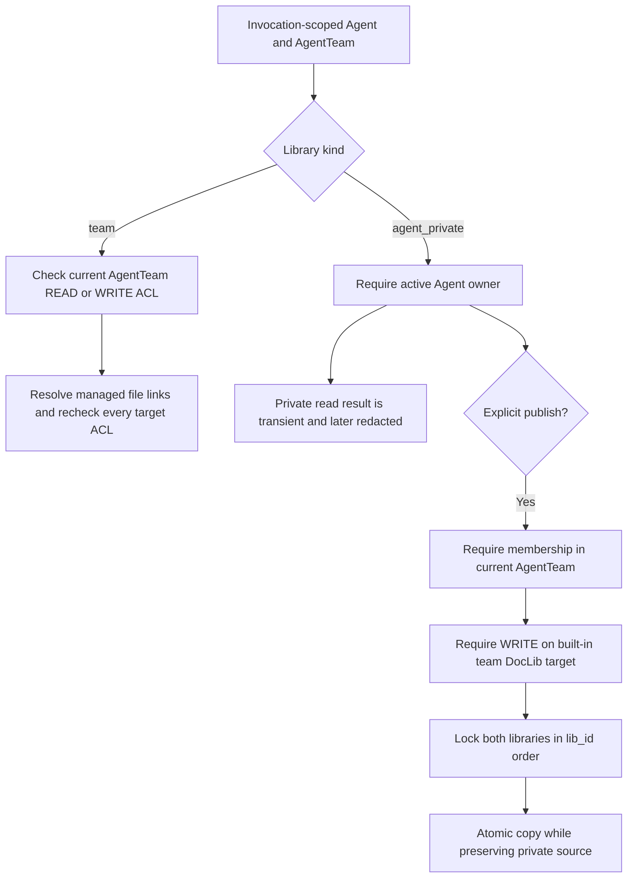

# Token-Based File Reading Flowcharts

This document visualizes token-counter resolution, range continuation, DocLib authorization, and private publication boundaries.

## 1. Model-Facing Read

The token budget applies only to decoded `content`. Status, continuation coordinates, counter metadata, and tool-protocol framing are outside the budget.

## 2. Counter Resolution

Counter selection occurs for every file invocation, so a successful model failover changes the counter used by the next read.

## 3. Continuation

Line endings are normalized to `\n`, and coordinates refer to decoded Unicode code points in that normalized view.

## 4. DocLib Authorization and Private Publication

Native filesystem symlinks remain forbidden. Private libraries never participate in team ACLs, public discovery, or managed links.
