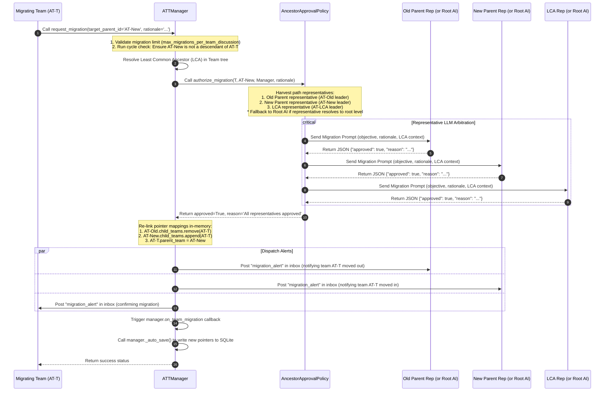

# Dynamic Lineage Migration Arbitration Sequence Diagram

This document sequences the Least Common Ancestor (LCA) resolution, representative path harvesting, LLM arbitration, and pointer restructuring executed during dynamic lineage migrations.

## 1. Lineage Migration Arbitration Sequence

The sequence diagram below visualizes the lifecycle of a migration request under the default **Ancestor Approval Policy** (`"ancestor_approval"`):

