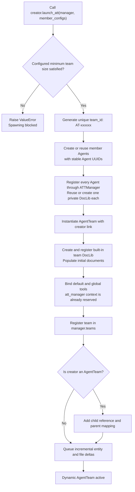
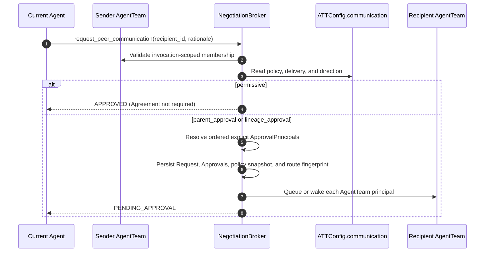
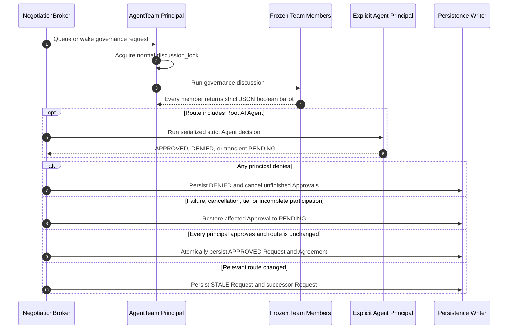
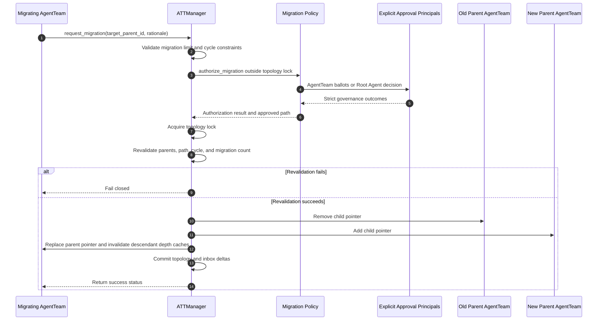
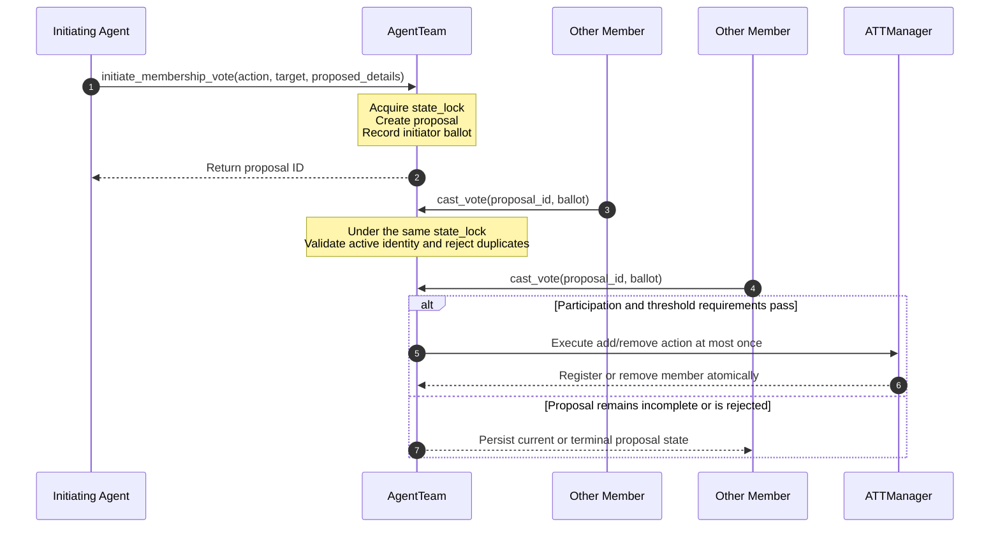
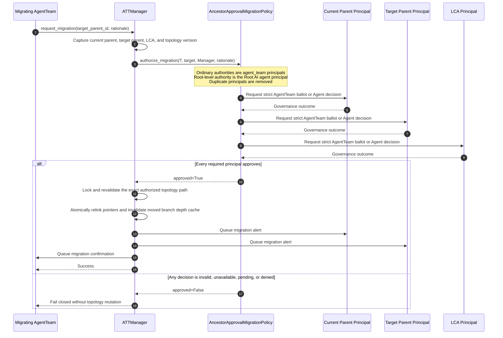

# Lineage Tree Mutations Flowcharts

This document consolidates the sequence flows that govern how the AgentTeam topology grows, restructures itself, and authorizes cross-team communication.

## 1. Dynamic Spawning & Tool Binding

This flowchart outlines the logic executed when an `Agent` or `AgentTeam` launches a dynamic sub-team:

## 2. Communication Request Routing

Communication policy comes only from `ATTConfig.communication`.

An Agent supplies the action for its invocation-scoped AgentTeam, but that action does not grant the Agent independent institutional authority.

## 3. Autonomous Approval & Agreement Sequence

AgentTeam principals decide through a serialized discussion and full-member ballots, while an explicit Agent principal decides under its own invocation lock.

The Root AI participates as `ApprovalPrincipal(kind="agent")` only when the configured topology path requires it.

The complete communication state machine is documented in [Autonomous Communication Governance](Autonomous_Communication_Governance.md).

## 4. Dynamic Lineage Migration (Overview)

This sequence diagram illustrates how an active AgentTeam requests a topology migration under the configured migration policy:

## 5. Democratic Membership Voting Sequence

This sequence diagram illustrates the lifecycle of a membership proposal from initiation to atomic execution:

## 6. Lineage Migration Arbitration (Deep Dive)

The default `ancestor_approval` policy uses only explicit authorities.

