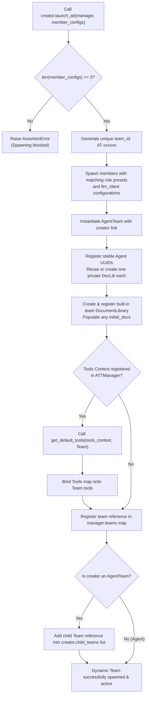
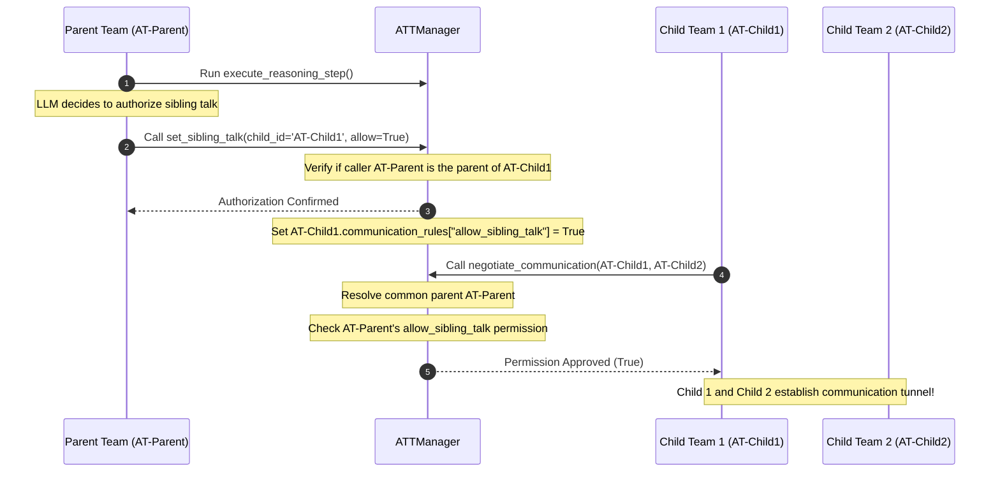
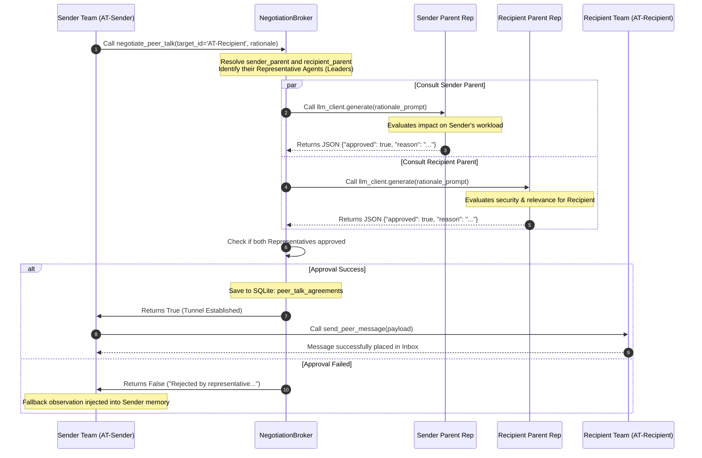
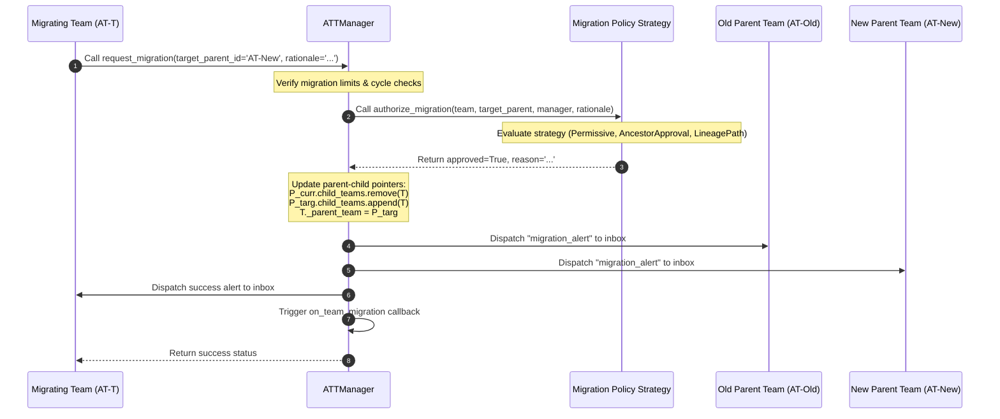
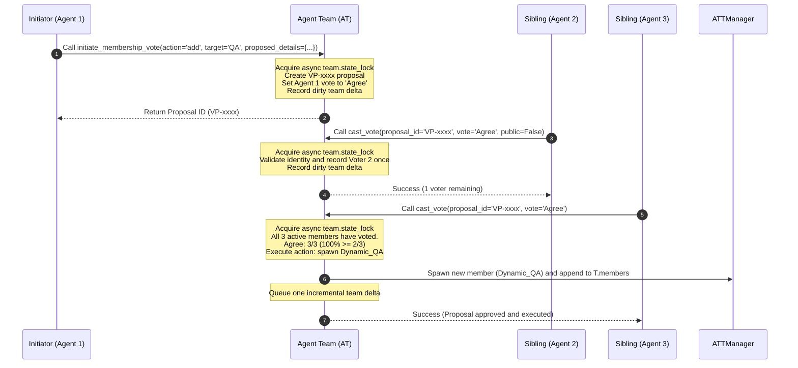
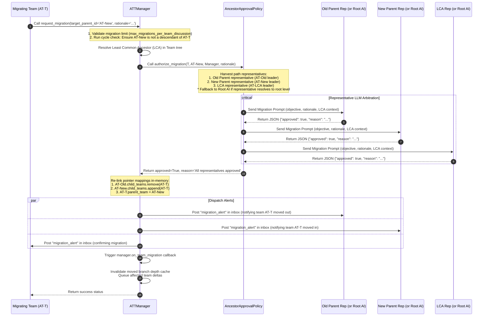

# Lineage Tree Mutations Flowcharts

This document consolidates the sequence flows that govern how the Agent Team topology dynamically grows, restructures itself, and authorizes cross-branch communication.

## 1. Dynamic Spawning & Tool Binding

This flowchart outlines the logic executed when an individual `Agent` or `AgentTeam` launches a dynamic sub-team:

## 2. Dynamic Sibling Talk Authorization Sequence

This sequence diagram illustrates how a Parent Team calls `set_sibling_talk` to dynamically authorize Sibling Teams to communicate:

## 3. Cross-Lineage Proxied Negotiation Sequence

This sequence diagram details the `ProxiedCommunicationPolicy` arbitration process executed by the `NegotiationBroker`. When two teams from completely different branches attempt to communicate, the Broker queries the Representative Agents (usually the Team Leaders) of both parent lineages to jointly authorize the P2P tunnel.

## 4. Dynamic Lineage Migration (Overview)

This sequence diagram illustrates how an active Agent Team calls `request_migration` to reorganize the lineage hierarchy, arbitrated by the configured Migration Policy Strategy:

## 5. Democratic Membership Voting Sequence

This sequence diagram illustrates the lifecycle of a democratic membership proposal, from initiation to unanimous voting and execution:

## 6. Lineage Migration Arbitration (Deep Dive)

The sequence diagram below visualizes the deeper lifecycle of a migration request under the default **Ancestor Approval Policy** (`"ancestor_approval"`):

