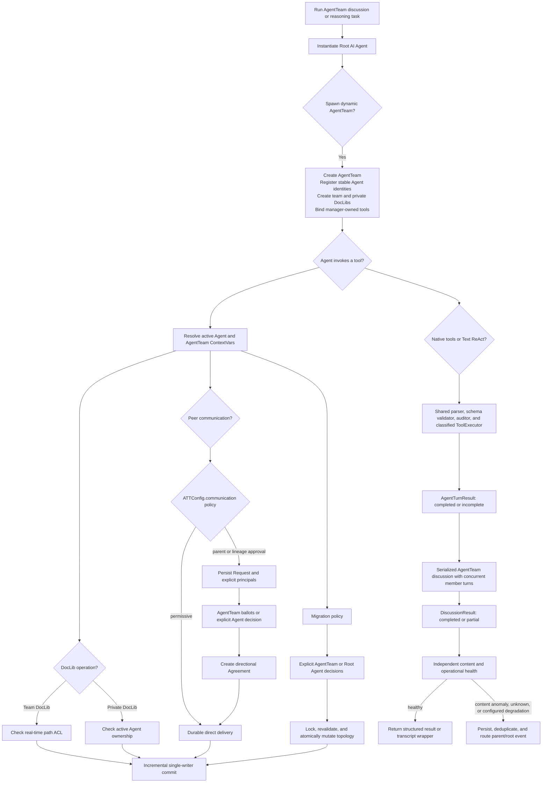

# ATT Autonomy Suite Flowcharts

This directory contains technical flowcharts and Mermaid sequence diagrams for the ATT autonomy, governance, persistence, and dynamic delegation systems.

## Flowchart Index

1. **[Autonomous Communication Governance](Autonomous_Communication_Governance.md)**: Shows configuration-owned communication policy, explicit governance principals, request lifecycle, agreements, revocation, and durable peer delivery.
2. **[Lineage Tree Mutations](Lineage_Tree_Mutations.md)**: Shows dynamic AgentTeam spawning, tool binding, membership voting, explicit-principal migration governance, and atomic topology mutation.
3. **[Gated FileReader Size Limits](Gated_Reading.md)**: Shows the `read_file` size protection, outline fallback, and line-window behavior.
4. **[Tooling & Execution Engines](Tooling_and_Execution.md)**: Shows tool auditing, multi-round ReAct execution, native tool calling, and parallel tool execution.
5. **[State Persistence & Recovery](State_Persistence.md)**: Shows task-local batching, the coalescing single-writer queue, incremental commits, and validated atomic restore.
6. **[Supervision & Emergencies](Supervision_and_Emergencies.md)**: Shows supervisory audits, UNKNOWN alert lifecycle, parent escalation, and emergency wakeups.

## Unified High-Level Flow Overview

The ATT suite coordinates these systems through invocation-scoped authority, serialized local decisions, and asynchronous incremental persistence.

