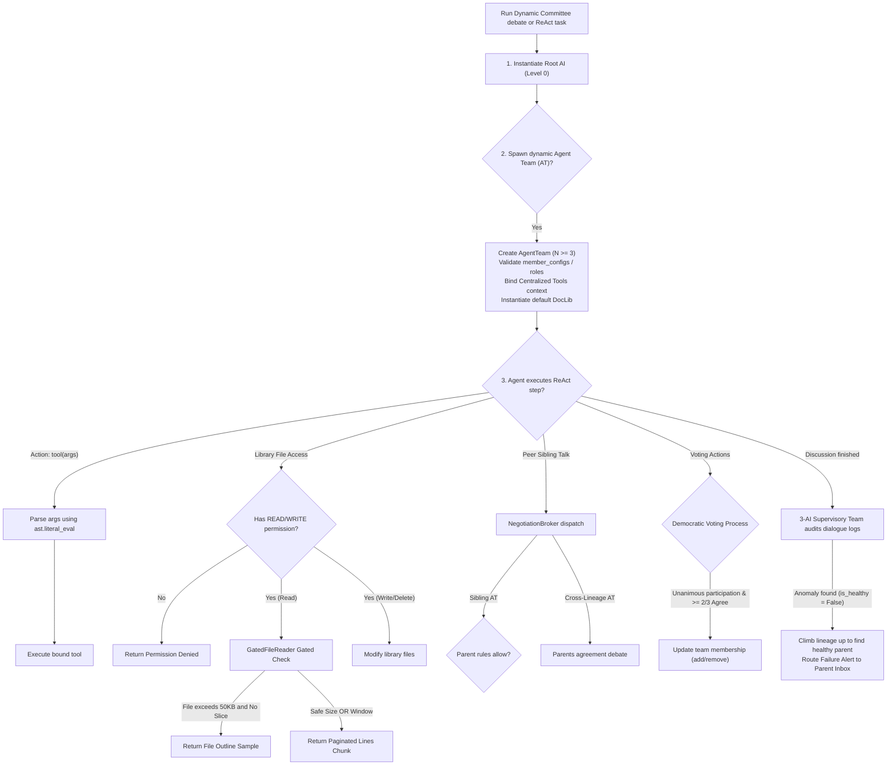

# ATT Autonomy Suite Flowcharts

This directory contains detailed technical flowcharts and Mermaid sequencing diagrams detailing the operational control flows of the **ATT (AI Team Team) Autonomy & Dynamic Delegation Suite**.

> [!NOTE]
> All flowcharts in this directory are fully updated, aligned with the Python package specifications, and represent the actual runtime execution control flows.

## Flowchart Index

Please refer to the following documents for granular flow diagrams:

1. **[Spawning, Escalation & Migration](Spawning_Escalation.md)**: Details the recursive `AgentTeam` lineages (Level 0 Root AI spawning Level 1 ATs, which recursively spawn deeper sub-teams of Level $N$), closed-loop parent escalation alerts, and LLM-arbitrated parent migrations.
2. **[Gated Paginator Reading](Gated_Reading.md)**: Visualizes the context protection pre-filters, outline warnings, paginated chunk slicing, and the segment-based DocLib ACL path permission resolution.
3. **[Negotiation Broker & Sibling Routing](Negotiation_Broker_Sibling_Routing.md)**: Sequences the dynamic P2P sibling and cross-lineage communication permissions negotiated by the `NegotiationBroker`.
4. **[Supervisory Team Audits & Escalations](Supervisory_Team_Audit.md)**: Diagrams the 3-AI Supervisory Team's dialogue auditing and the recursive parent-ancestor climb escalation process.
5. **[State Persistence & Recovery](State_Persistence.md)**: Visualizes the SQLite-backed auto-saving event triggers and the manager's two-pass deserialization pipeline.
6. **[Discussion & ReAct Execution Loop](Execution_Loop.md)**: Visualizes the master multi-round debate sequence and the granular agent turn ReAct execution step compilation.
7. **[Lineage Migration Arbitration Sequence](Lineage_Migration_Arbitration.md)**: Diagrams the step-by-step Least Common Ancestor (LCA) resolution, representatives harvesting, and LLM arbitration rounds during team migrations.

## Unified High-Level Flow Overview

The ATT Suite coordinates the interaction of these four systems in a decoupled, event-driven pattern:

