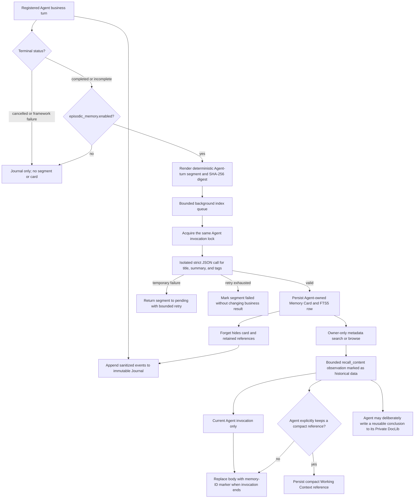

# Selective Episodic Memory Flow

```mermaid
flowchart TD
    Turn["Registered Agent business turn"] --> Journal["Append sanitized events to immutable Journal"]
    Turn --> Terminal{"Terminal status?"}
    Terminal -->|completed or incomplete| Enabled{"episodic_memory.enabled?"}
    Terminal -->|cancelled or framework failure| Stop["Journal only; no segment or card"]
    Enabled -->|no| Stop
    Enabled -->|yes| Segment["Render deterministic Agent-turn segment and SHA-256 digest"]
    Segment --> Queue["Bounded background index queue"]
    Queue --> AgentLock["Acquire the same Agent invocation lock"]
    AgentLock --> Labels["Isolated strict JSON call for title, summary, and tags"]
    Labels -->|valid| Card["Persist Agent-owned Memory Card and FTS5 row"]
    Labels -->|temporary failure| Retry["Return segment to pending with bounded retry"]
    Labels -->|retry exhausted| Failed["Mark segment failed without changing business result"]
    Card --> Search["Owner-only metadata search or browse"]
    Search --> Recall["Bounded recall_content observation marked as historical data"]
    Recall --> Invocation["Current Agent invocation only"]
    Invocation --> Cleanup["Replace body with memory-ID marker when invocation ends"]
    Recall --> Keep{"Agent explicitly keeps a compact reference?"}
    Keep -->|yes| Working["Persist compact Working Context reference"]
    Keep -->|no| Cleanup
    Recall --> Private["Agent may deliberately write a reusable conclusion to its Private DocLib"]
    Card --> Forget["Forget hides card and retained references"]
    Forget --> Journal
```

The ownership key is always `agent_id`, so a team membership mutation has no edge to the Journal, segment, card, retained-reference, or Private DocLib state.
