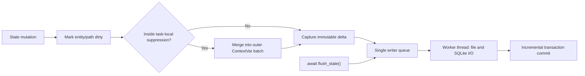
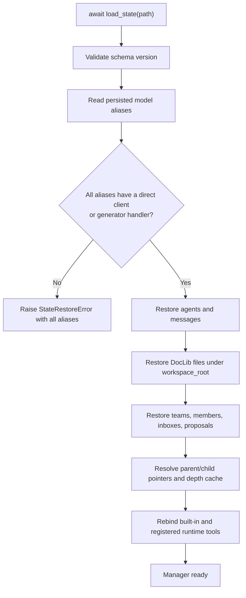

# State Persistence and Recovery Flow

```mermaid
flowchart LR
    Mutation["State mutation"] --> Dirty["Mark entity/path dirty"]
    Dirty --> Scope{"Inside task-local suppression?"}
    Scope -- "Yes" --> Merge["Merge into outer ContextVar batch"]
    Scope -- "No" --> Capture["Capture immutable delta"]
    Merge --> Capture
    Capture --> Queue["Single writer queue"]
    Queue --> Worker["Worker thread: file and SQLite I/O"]
    Worker --> Commit["Incremental transaction commit"]
    Flush["await flush_state()"] --> Queue
```

```mermaid
flowchart TD
    Load["await load_state(path)"] --> Version["Validate schema version"]
    Version --> Aliases["Read persisted model aliases"]
    Aliases --> Bindings{"All aliases have a direct client\nor generator handler?"}
    Bindings -- "No" --> Error["Raise StateRestoreError with all aliases"]
    Bindings -- "Yes" --> Agents["Restore agents and messages"]
    Agents --> Files["Restore DocLib files under workspace_root"]
    Files --> Teams["Restore teams, members, inboxes, proposals"]
    Teams --> Pointers["Resolve parent/child pointers and depth cache"]
    Pointers --> Runtime["Rebind built-in and registered runtime tools"]
    Runtime --> Ready["Manager ready"]
```

The schema is versioned and intentionally does not migrate old databases.
