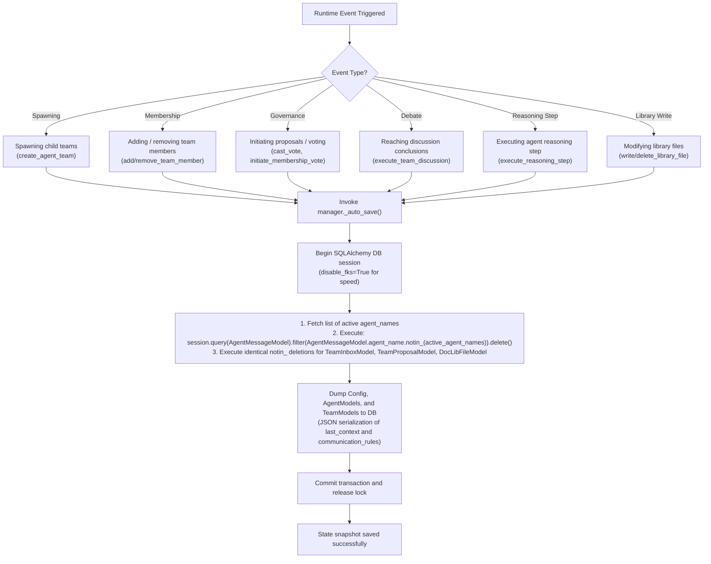
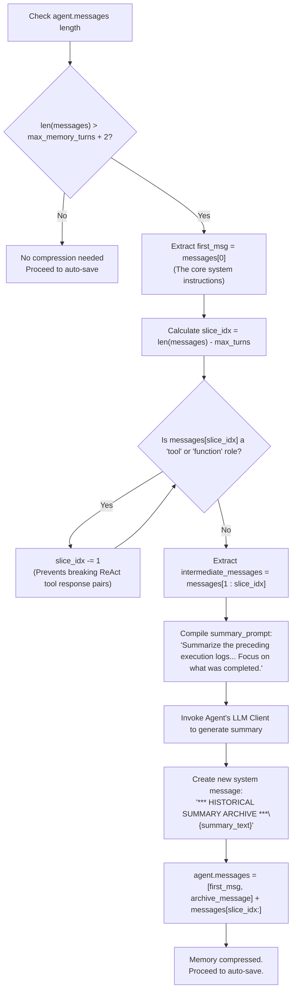
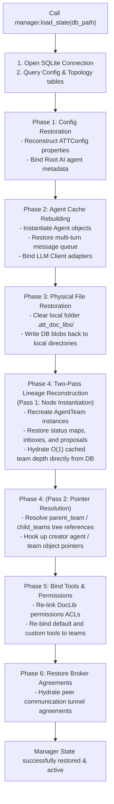

# State Persistence & Recovery Lifecycle Flowcharts

This document visualizes the database auto-save hooks, serialization rules, the $O(1)$ memory compression logic, and the two-pass recovery pipeline of the SQLite state persistence engine.

## 1. State Persistence Auto-Save Triggers (Deep Dive)

This flowchart shows the critical runtime events that automatically trigger SQLite state serialization via SQLAlchemy ORM, explicitly mapping how $O(1)$ garbage collection is performed via `notin_` cascading deletions.

## 2. Multi-Turn Memory Compression & Pruning

This flowchart maps the `max_memory_turns` logic. To prevent Out-Of-Memory (OOM) errors during long-running tasks, the agent dynamically prunes early conversation history and replaces it with a condensed, LLM-generated summary.

## 3. Recovery Workflow & Two-Pass Deserialization Pipeline

This flowchart outlines the execution phases when restoring the manager state from a database using `load_state(db_path)`:

