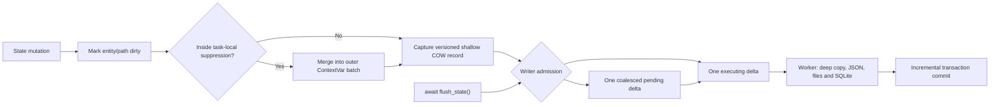
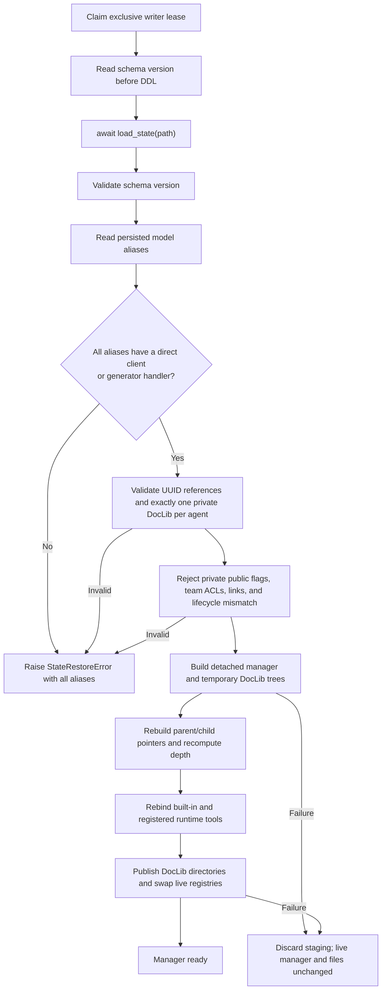

# State Persistence and Recovery Flow

- SQLite uses foreign keys, WAL, and an explicit busy timeout.
- A second manager or process fails its non-blocking writer lease immediately.
- Schema 7 stores autonomous communication records together with the separated Working Context, append-only Journal, optional episodic-memory catalog, source provenance, retained references, and FTS5 index.
- It intentionally does not migrate old databases.
