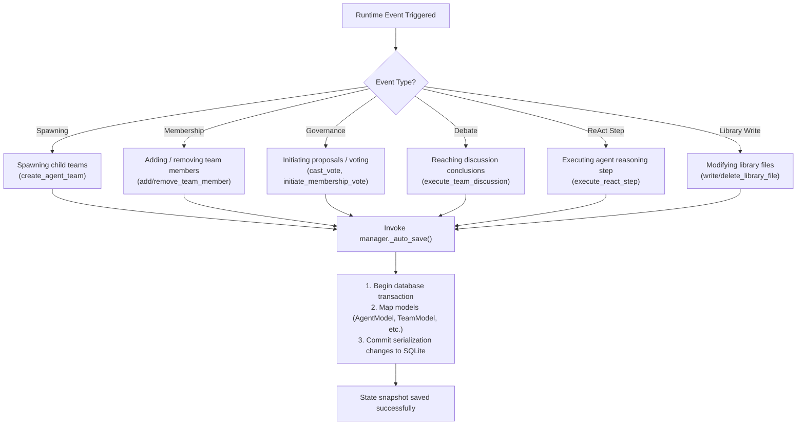
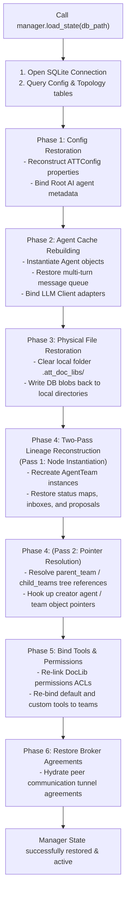

# State Persistence & Recovery Lifecycle Flowcharts

This document visualizes the database auto-save hooks, serialization rules, and the two-pass recovery pipeline of the SQLite state persistence engine.

## 1. State Persistence Auto-Save Triggers

This flowchart shows the critical runtime events that automatically trigger SQLite state serialization via SQLAlchemy ORM:

## 2. Recovery Workflow & Two-Pass Deserialization Pipeline

This flowchart outlines the execution phases when restoring the manager state from a database using `load_state(db_path)`:

