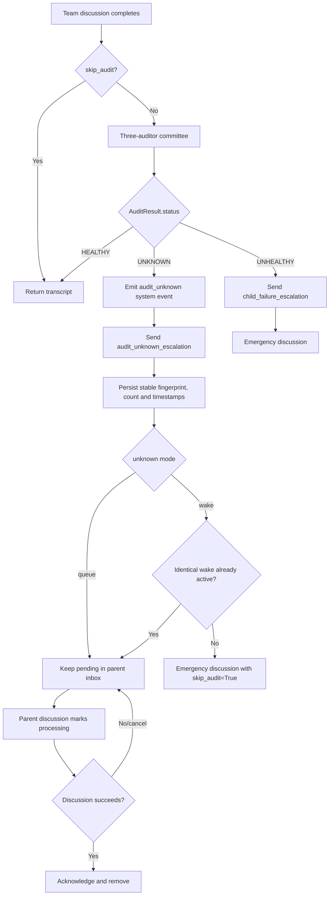

# Supervision and Emergency Flow

Root-level escalations use callbacks and structured system events. Unknown audit wakeups are durably deduplicated and skip one supervisory cycle to prevent recursive audit storms. Alerts have no TTL or hard drop limit; a soft threshold only emits operational events.
