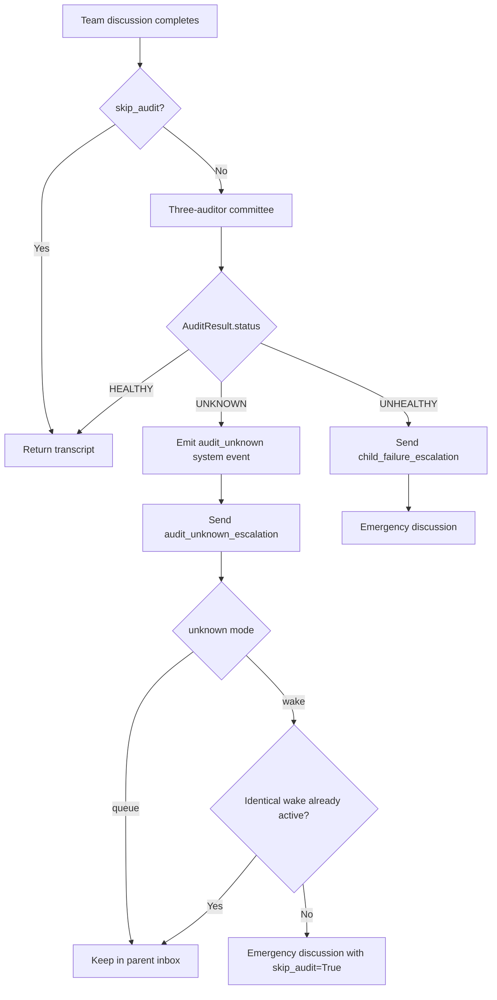

# Supervision and Emergency Flow

Root-level escalations use callbacks and structured system events. Unknown
audit wakeups are deduplicated and skip one supervisory cycle to prevent
recursive audit storms.
