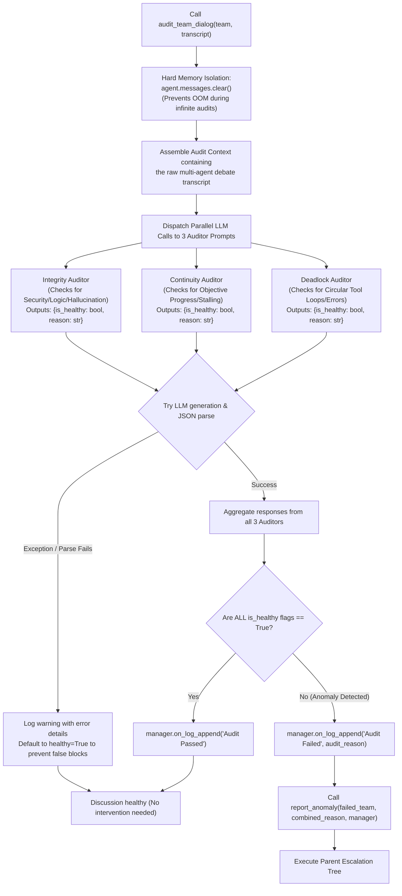
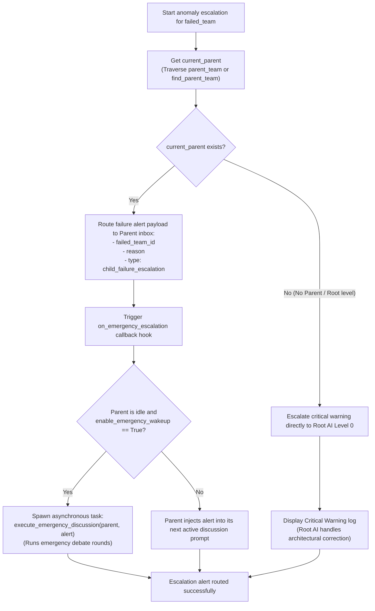
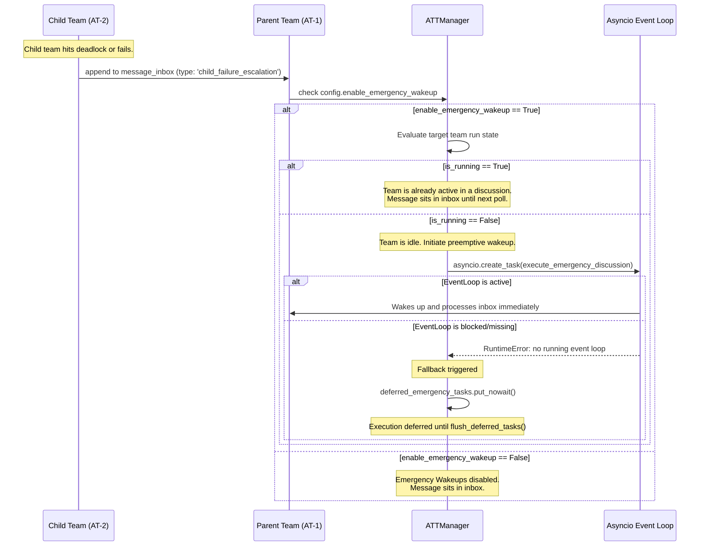

# Supervision and Emergencies Flowcharts

This document details the dialogue auditing logic, the recursive lineage escalation protocol executed by the **Supervisory Team**, and the emergency event-driven wakeup protocols.

## 1. 3-AI Dialogue Auditing Logic (Deep Dive)

This flowchart outlines the exact 3-AI consensus sequence executed post-discussion. The manager invokes three specialized LLM Auditor agents in parallel to verify overall dialogue health, mapping the output to an `is_healthy` boolean and triggering `on_log_append` for debugging.

## 2. Parent-Ancestor Escalation Tree

This flowchart visualizes the direct parent escalation checks executed by `SupervisoryTeam.report_anomaly` to route failure alerts:

## 3. Emergency Wakeup Routing (Deep Dive)

This sequence diagram dives deeper into the specific control flow when a child team escalates an emergency, detailing how the `enable_emergency_wakeup` flag triggers preemptive `asyncio` context switches, and how it safely falls back to a deferred execution queue.

