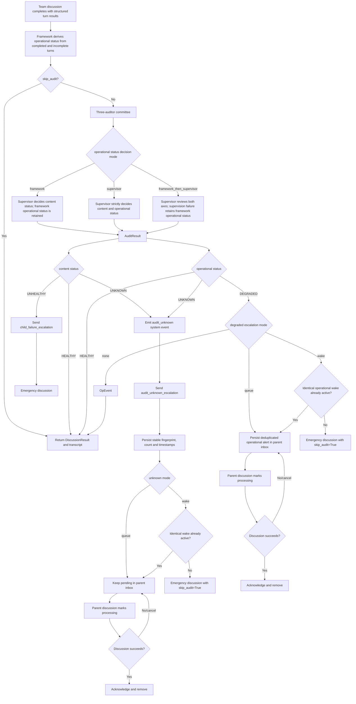

# Supervision and Emergency Flow

Content health and operational health are independent, so an unhealthy discussion may also be operationally degraded.

Root-level escalations use callbacks and structured system events.

Unknown audit and degraded operational wakeups are durably deduplicated and skip one supervisory cycle to prevent recursive audit storms.

Alerts have no TTL or hard drop limit; a soft threshold only emits operational events.
