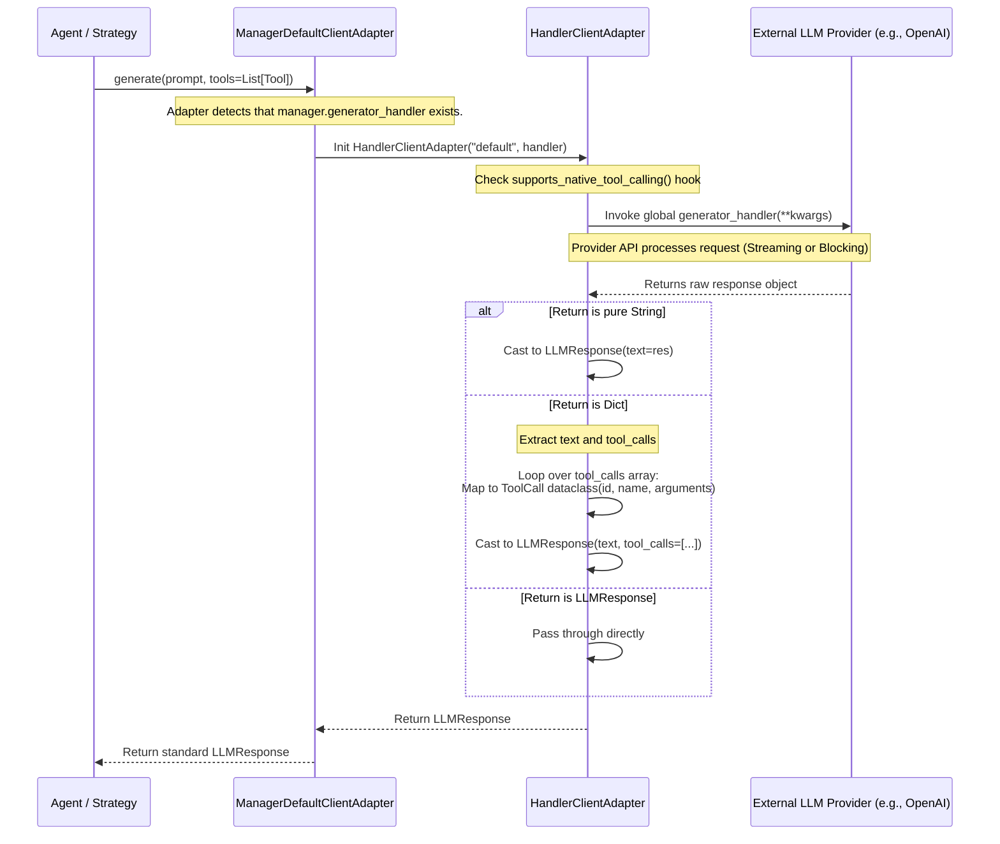
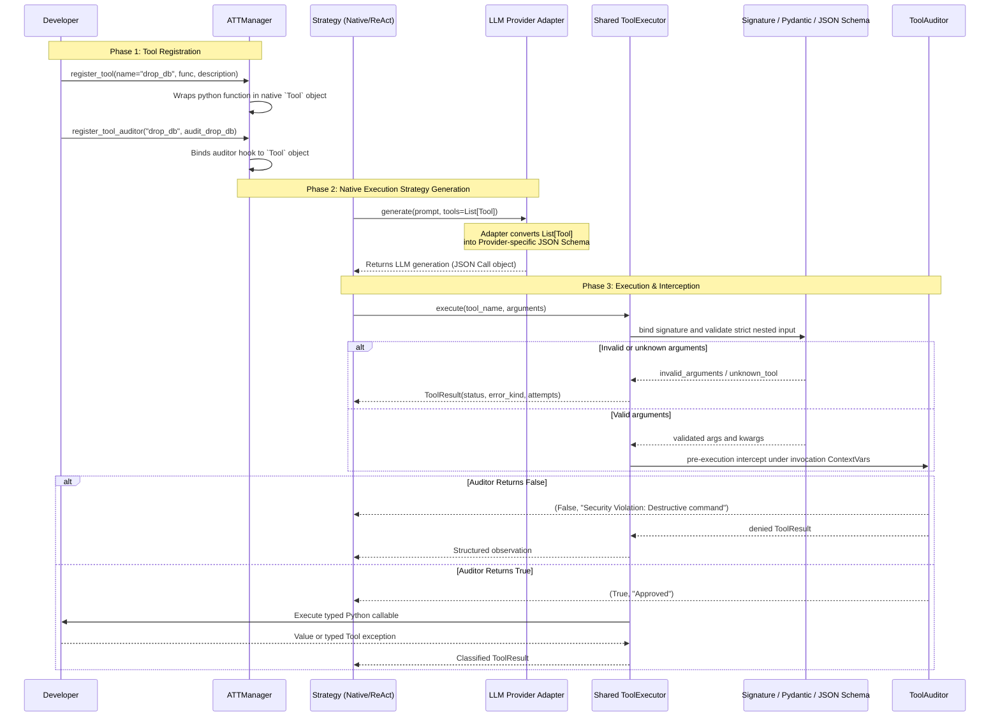
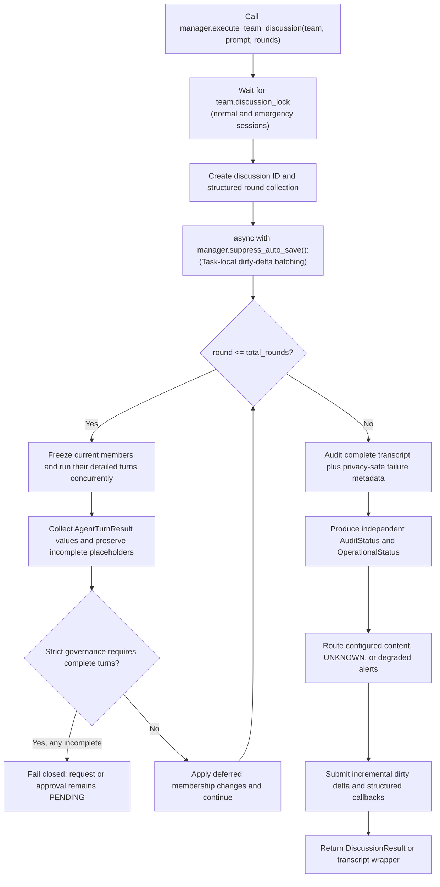
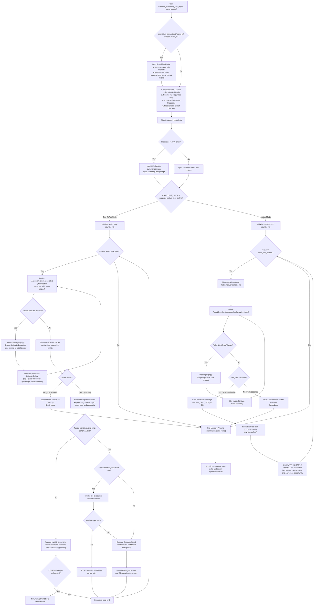

# Tooling and Execution Flowcharts

This document consolidates the sequence flows defining how tools are parsed, audited, and executed within the runtime reasoning loops of the framework, as well as the low-level adapter logic for the LLM integrations.

## 1. LLM Adapter Streaming vs Sync Execution (Deep Dive)

This sequence diagram details how `ManagerDefaultClientAdapter` wraps the global `generator_handler`, checks for native schema support, and translates raw Python generator chunks (from sync or async LLM APIs) into standardized `LLMResponse` objects containing parsed `ToolCall` data structures.

## 2. Tool Parsing & Auditor Lifecycle

This sequence diagram maps the exact lifecycle of a Python function as it is registered as an ATT Tool, routed through an adapter under the Thorough Abstraction Paradigm, generated by an LLM, intercepted by a `ToolAuditor` hook, and finally executed.

## 3. Master Discussion Loop (`execute_team_discussion`)

This flowchart sequences the multi-round cooperative debate process executed when a team is tasked with resolving a prompt.

## 4. Granular Agent Turn (`execute_reasoning_step`)

This flowchart outlines prompt compilation, invocation-time tool visibility, strategy routing, strict parsing and validation, classified retries, and structured member failure isolation during one Agent turn.

